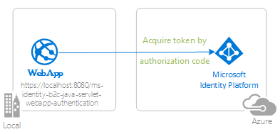
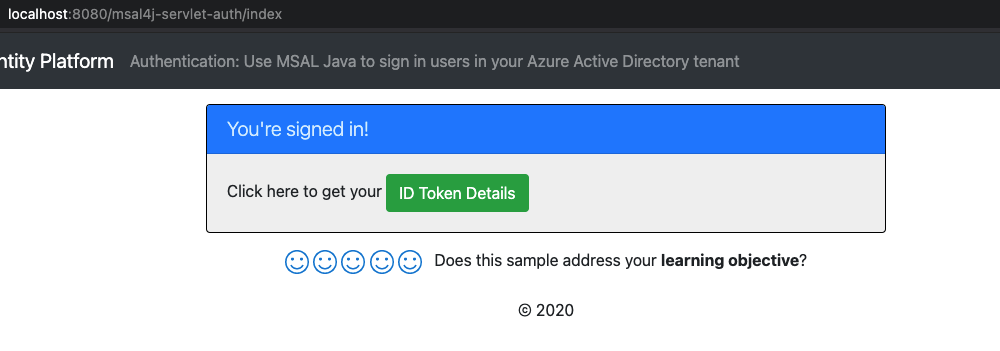

# Enable your Java Servlet web app to sign in users to your Azure Active Directory tenant with the Microsoft identity platform

- [Overview](#overview)
- [Scenario](#scenario)
- [Contents](#contents)
- [Prerequisites](#prerequisites)
- [Setup](#setup)
  - [Clone or download this repository](#clone-or-download-this-repository)
- [Register the sample application with your Azure Active Directory tenant](#register-the-sample-application-with-your-azure-active-directory-tenant)
  - [Register the web app (java-servlet-webapp-authentication)](#register-the-web-app-java-servlet-webapp-authentication)
  - [Configure the web app (java-servlet-webapp-authentication) to use your app registration](#configure-the-web-app-java-servlet-webapp-authentication-to-use-your-app-registration)
- [Running the sample](#running-the-sample)
- [Explore the sample](#explore-the-sample)
- [We'd love your feedback!](#wed-love-your-feedback)
- [About the code](#about-the-code)
  - [Step-by-step walkthrough](#step-by-step-walkthrough)
  - [Scopes](#scopes)
- [Next Steps or Deploy to Azure](#next-steps-or-deploy-to-azure)
- [Community Help and Support](#community-help-and-support)
- [Contributing](#contributing)
- [Code of Conduct](#code-of-conduct)
- [More information](#more-information)

## Overview

This sample demonstrates a Java Servlet web app that signs in users to your Azure Active Directory tenant using the [Microsoft Authentication Library (MSAL) for Java](https://github.com/AzureAD/microsoft-authentication-library-for-java).



## Scenario

1. This web application uses **MSAL for Java (MSAL4J)** to sign in users to their own Azure AD tenant and obtains an [ID Token](https://docs.microsoft.com/azure/active-directory/develop/id-tokens) from **Azure AD**.
2. The **ID Token** proves that a user has successfully authenticated with this tenant.
3. The web application protects one of its routes according to user's authentication status.

## Contents

| File/folder                                                        | Description                                                                            |
| ------------------------------------------------------------------ | -------------------------------------------------------------------------------------- |
| `AppCreationScripts/`                                              | Scripts to automatically configure Azure AD app registrations.                         |
| `src/main/java/com/microsoft/azuresamples/msal4j/authwebapp/`      | This directory contains the classes that define the web app's backend business logic.  |
| `src/main/java/com/microsoft/azuresamples/msal4j/authservlets/`    | This directory contains the classes that are used for sign in and sign out endpoints.  |
| `____Servlet.java`                                                 | All of the endpoints available are defined in .java classes ending in ____Servlet.java.|
| `src/main/java/com/microsoft/azuresamples/msal4j/helpers/`         | Helper classes for authentication.                                                     |
| `AuthenticationFilter.java`                                        | Redirects unauthenticated requests to protected endpoints to a 401 page.               |
| `src/main/resources/authentication.properties`                     | Azure AD and program configuration.                                                    |
| `src/main/webapp/`                                                 | This directory contains the UI (JSP templates)                                         |
| `CHANGELOG.md`                                                     | List of changes to the sample.                                                         |
| `CONTRIBUTING.md`                                                  | Guidelines for contributing to the sample.                                             |
| `LICENSE`                                                          | The license for the sample.                                                            |

## Prerequisites

- [JDK Version 15](https://jdk.java.net/15/). This sample has been developed on Java 15 but should be compatible with some lower versions.
- [Maven 3](https://maven.apache.org/download.cgi)
- [Tomcat 9](https://tomcat.apache.org/download-90.cgi)
- An Azure Active Directory (Azure AD) tenant. For more information on how to get an Azure AD tenant, see [How to get an Azure AD tenant](https://azure.microsoft.com/documentation/articles/active-directory-howto-tenant/)
- A user account in your own Azure AD tenant if you want to work with **accounts in your organizational directory only** (single-tenant mode). If have not yet [created a user account](https://docs.microsoft.com/azure/active-directory/fundamentals/add-users-azure-active-directory) in your AD tenant yet, you should do so before proceeding.
- A user account in any organization's Azure AD tenant if you want to work with **accounts in any organizational directory** (multi-tenant mode).  This sample must be modified to work with a **personal Microsoft account**. If have not yet [created a user account](https://docs.microsoft.com/azure/active-directory/fundamentals/add-users-azure-active-directory) in your AD tenant yet, you should do so before proceeding.
- A personal Microsoft account (e.g., Xbox, Hotmail, Live, etc) if you want to work with **personal Microsoft accounts**

## Setup

### Clone or download this repository

From your shell or command line:

```console
git clone https://github.com/Azure-Samples/ms-identity-java-servlet-webapp-authentication.git
cd 1-Authentication/sign-in
```

or download and extract the repository .zip file.

> :warning: To avoid file path length limitations on Windows, clone the repository into a directory near the root of your hard drive.

## Register the sample application with your Azure Active Directory tenant

There is one project in this sample. To register the app on the portal, you can:

- either follow manual configuration steps below
- or use PowerShell scripts that:
  - **automatically** creates the Azure AD applications and related objects (passwords, permissions, dependencies) for you.
  - modify the projects' configuration files.
  - by default, the automation scripts set up an application that works with **accounts in your organizational directory only**.

<details>
  <summary>Expand this section if you want to use PowerShell automation.</summary>

1. On Windows, run PowerShell and navigate to the root of the cloned directory
1. In PowerShell run:

   ```PowerShell
   Set-ExecutionPolicy -ExecutionPolicy RemoteSigned -Scope Process -Force
   ```

1. Run the script to create your Azure AD application and configure the code of the sample application accordingly.
1. In PowerShell run:

   ```PowerShell
   cd .\AppCreationScripts\
   .\Configure.ps1
   ```

   > Other ways of running the scripts are described in [App Creation Scripts](./AppCreationScripts/AppCreationScripts.md)
   > The scripts also provide a guide to automated application registration, configuration and removal which can help in your CI/CD scenarios.

</details>

### Register the web app (java-servlet-webapp-authentication)

[Register a new web app](https://docs.microsoft.com/azure/active-directory/develop/quickstart-register-app) in the [Azure Portal](https://portal.azure.com).
Following this guide, you must:

1. Navigate to the Microsoft identity platform for developers [App registrations](https://go.microsoft.com/fwlink/?linkid=2083908) page.
1. Select **New registration**.
1. In the **Register an application page** that appears, enter your application's registration information:
   - In the **Name** section, enter a meaningful application name that will be displayed to users of the app, for example `java-servlet-webapp-authentication`.
   - Under **Supported account types**, select an option.
     - Select **Accounts in this organizational directory only** if you're building an application for use only by users in your tenant (**single-tenant**).
     - Select **Accounts in any organizational directory** if you'd like users in any Azure AD tenant to be able to use your application (**multi-tenant**).
     - Select **Accounts in any organizational directory and personal Microsoft accounts** for the widest set of customers (**multi-tenant** that also supports Microsoft personal accounts).
   - Select **Personal Microsoft accounts** for use only by users of personal Microsoft accounts (e.g., Hotmail, Live, Skype, Xbox accounts).
   - In the **Redirect URI** section, select **Web** in the combo-box and enter the following redirect URI: `http://localhost:8080/msal4j-servlet-webapp/auth/redirect`.
1. Select **Register** to create the application.
1. In the app's registration screen, find and note the **Application (client) ID**. You use this value in your app's configuration file(s) later in your code.
1. Select **Save** to save your changes.
1. In the app's registration screen, click on the **Certificates & secrets** blade in the left to open the page where we can generate secrets and upload certificates.
1. In the **Client secrets** section, click on **New client secret**:
   - Type a key description (for instance `app secret`),
   - Select one of the available key durations (**In 1 year**, **In 2 years**, or **Never Expires**) as per your security concerns.
   - The generated key value will be displayed when you click the **Add** button. Copy the generated value for use in the steps later.
   - You'll need this key later in your code's configuration files. This key value will not be displayed again, and is not retrievable by any other means, so make sure to note it from the Azure portal before navigating to any other screen or blade.

### Configure the web app (java-servlet-webapp-authentication) to use your app registration

Open the project in your IDE to configure the code.

> In the steps below, "ClientID" is the same as "Application ID" or "AppId".

1. Open the `./src/main/resources/authentication.properties` file
2. Find the string `{enter-your-tenant-id-here}`. Replace the existing value with:
    - **Your Azure AD tenant ID** if you registered your app with the **Accounts in this organizational directory only** option.
    - The word `organizations` if you registered your app with the **Accounts in any organizational directory** option.
    - The word `common` if you registered your app with the **Accounts in any organizational directory and personal Microsoft accounts** option.
    - The word `consumers` if you registered your app with the **Personal Microsoft accounts** option
3. Find the string `{enter-your-client-id-here}` and replace the existing value with the application ID (clientId) of the `java-servlet-webapp-authentication` application copied from the Azure portal.
4. Find the string `{enter-your-client-secret-here}` and replace the existing value with the key you saved during the creation of the `java-servlet-webapp-authentication` app, in the Azure portal.

</details>

## Running the sample

1. Make certain that your Tomcat server is running and you have privileges to deploy a web app to it.
2. Make certain that your server host address is `http://localhost:8080` (or change the `app.homePage` value in your [authentication.properties](src/main/resources/authentication.properties) file and in the AAD app registration).
3. Compile and package the project using **Maven**:

    ```Shell
    cd project-directory
    mvn clean package
    ```

4. Find the resulting `.war` file in `./target/msal4j-servlet-webapp.war` and deploy it to Tomcat or any other J2EE container solution.
     - To deploy to Tomcat, copy this `.war` file to the `/webapps/` directory in your Tomcat installation directory and start the Tomcat server.
5. Ensure that the context path that the app is served on is `/msal4j-servlet-webapp` (or change the `app.homePage` value in your [authentication.properties](src/main/resources/authentication.properties) file and in the AAD app registration). If you change the properties file, you'll needs to repeat step 3 above (maven clean and package).
6. Open your browser and navigate to `http://localhost:8080/msal4j-servlet-webapp/`



## Explore the sample

- Note the signed-in or signed-out status displayed at the center of the screen.
- Click the context-sensitive button at the top right (it will read `Sign In` on first run)
- Follow the instructions on the next page to sign in with an account in the Azure AD tenant.
- On the consent screen, note the scopes that are being requested.
- Note the context-sensitive button now says `Sign out` and displays your username to its left.
- The middle of the screen now has an option to click for **ID Token Details**: click it to see some of the ID token's decoded claims.
- You can also use the button on the top right to sign out.
- After signing out, click the link to `ID Token Details` to observe that the app displays a `401: unauthorized` error instead of the ID token claims when the user is not authorized.

> :information_source: Did the sample not work for you as expected? Did you encounter issues trying this sample? Then please reach out to us using the [GitHub Issues](../../issues) page.

## We'd love your feedback!

Were we successful in addressing your learning objective? Consider taking a moment to [share your experience with us](https://forms.office.com/Pages/ResponsePage.aspx?id=v4j5cvGGr0GRqy180BHbR73pcsbpbxNJuZCMKN0lURpURDQwVUxQWENUMlpLUlA0QzdJNVE3TUJRSyQlQCN0PWcu).

## About the code

This sample shows how to use **MSAL for Java (MSAL4J)** to sign in users into your Azure AD tenant. You must add it to the project using Maven. You must add these to your projects using Maven. As a developer, you may copy the contents of the `helpers` and `authservlets` package folders in the `src/main/java/com/microsoft/azuresamples/msal4j` package. You'll also need an [authentication.properties file](src/main/resources/authentication.properties).

A **ConfidentialClientApplication** instance is created in the [AuthHelper.java](src/main/java/com/microsoft/azuresamples/authentication/AuthHelper.java) class. This object helps craft the AAD authorization URL and also helps exchange the authentication token for an access token.

```Java
// getConfidentialClientInstance method
IClientSecret secret = ClientCredentialFactory.createFromSecret(SECRET);
confClientInstance = ConfidentialClientApplication
                    .builder(CLIENT_ID, secret)
                    .authority(AUTHORITY)
                    .build();
```

The following parameters need to be provided upon instantiation:

- The **Client ID** of the app
- The **Client Secret**, which is a requirement for Confidential Client Applications
- The **Azure AD Authority**, which includes your AAD tenant ID.

In this sample, these values are read from the [authentication.properties](src/main/resources/authentication.properties) file using a properties reader in the class [Config.java](src/main/java/com/microsoft/azuresamples/authentication/Config.java).

### Step-by-step walkthrough

1. The first step of the sign-in process is to send a request to the `/authorize` endpoint on for our Azure Active Directory Tenant. Our MSAL4J `ConfidentialClientApplication` instance is leveraged to construct an authorization request URL. Our app redirects the browser to this URL, which is where the user will sign in.

    ```Java
    final ConfidentialClientApplication client = getConfidentialClientInstance();
    final AuthorizationRequestUrlParameters parameters = AuthorizationRequestUrlParameters
        .builder(REDIRECT_URI, Collections.singleton(SCOPES)).responseMode(ResponseMode.QUERY)
        .prompt(Prompt.SELECT_ACCOUNT).state(state).nonce(nonce).build();

    final String redirectUrl = client.getAuthorizationRequestUrl(parameters).toString();
    Config.logger.log(Level.INFO, "Redirecting user to {0}", redirectUrl);
    resp.setStatus(302);
    resp.sendRedirect(redirectUrl);
    ```

    - **AuthorizationRequestUrlParameters**: Parameters that must be set in order to build an AuthorizationRequestUrl.
    - **REDIRECT_URI**: Where AAD will redirect the browser (along with auth code) after collecting user credentials. It must match the redirect URI in the  Azure AD app registration on https://portal.azure.com
    - **SCOPES**: [Scopes](https://docs.microsoft.com/azure/active-directory/develop/access-tokens#scopes) are permissions requested by the application.
      - Normally, the three scopes `openid profile offline_access` suffice for receiving an ID Token response.
      - Full list of scopes requested by the app can be found in the [authentication.properties file](./src/main/resources/authentication.properties). You can add more scopes like User.Read and so on.

2. The user is presented with a sign-in prompt by Azure Active Directory. If the sign-in attempt is successful, the user's browser is redirected to our app's redirect endpoint. A valid request to this endpoint will contain an [**authorization code**](https://docs.microsoft.com/azure/active-directory/develop/v2-oauth2-auth-code-flow).
3. Our ConfidentialClientApplication instance then exchanges this authorization code for an ID Token and Access Token from Azure Active Directory.

    ```Java
    final AuthorizationCodeParameters authParams = AuthorizationCodeParameters
                        .builder(authCode, new URI(REDIRECT_URI))
                        .scopes(Collections.singleton(SCOPES)).build();

    final ConfidentialClientApplication client = AuthHelper
            .getConfidentialClientInstance();
    final Future<IAuthenticationResult> future = client.acquireToken(authParams);
    final IAuthenticationResult result = future.get();
    ```

    - **AuthorizationCodeParameters**: Parameters that must be set in order to exchange the Authorization Code for an ID and/or access token.
    - **authCode**: The authorization code that was received at the redirect endpoint.
    - **REDIRECT_URI**: The redirect URI used in the previous step must be passed again.
    - **SCOPES**: The scopes used in the previous step must be passed again.

4. If `acquireToken` is successful, the token claims are extracted and placed in an instance of IdentityContextData (e.g., `context`) and saved to the session. The application then instantiates this from the session whenever it needs access to it.

### Scopes

- [Scopes](https://docs.microsoft.com/azure/active-directory/develop/v2-permissions-and-consent) tell Azure AD the level of access that the application is requesting.
- Based on the requested scopes, Azure AD presents a consent dialogue to the user upon signing in.
- If the user consents to one or more scopes and obtains a token, the scopes-consented-to are encoded into the resulting `access_token`.
- Note the scopes requested by the application by referring to [authentication.properties](./src/main/resources/authentication.properties). These three scopes are requested by MSAL and given by Azure Active Directory by default.

## Next Steps or Deploy to Azure

As next steps, we can now either [get an Access Token for the users we signed-in in this tutorial](https://github.com/Azure-Samples/ms-identity-java-servlet-webapp-call-graph), or we can proceed [to deploy this app to the **Azure App Service**](https://github.com/Azure-Samples/ms-identity-java-servlet-webapp-deployment).

## Community Help and Support

Use [Stack Overflow](https://stackoverflow.com/questions/tagged/msal) to get support from the community.
Ask your questions on Stack Overflow first and browse existing issues to see if someone has asked your question before.
Make sure that your questions or comments are tagged with [`azure-active-directory` `ms-identity` `java` `msal`].

If you find a bug in the sample, please raise the issue on [GitHub Issues](../../issues).

To provide a recommendation, visit the following [User Voice page](https://feedback.azure.com/forums/169401-azure-active-directory).

## Contributing

This project welcomes contributions and suggestions. Most contributions require you to agree to a Contributor License Agreement (CLA) declaring that you have the right to, and actually do, grant us the rights to use your contribution. For details, visit https://cla.opensource.microsoft.com

## Code of Conduct

This project has adopted the Microsoft Open Source Code of Conduct. For more information see the Code of Conduct FAQ or contact opencode@microsoft.com with any additional questions or comments.

## More information

- [Microsoft Authentication Library \(MSAL\) for Java](https://github.com/AzureAD/microsoft-authentication-library-for-java)
- [MSAL Java Reference Documentation](http://javadoc.io/doc/com.microsoft.azure/msal4j)
- [Microsoft identity platform (Azure Active Directory for developers)](https://docs.microsoft.com/azure/active-directory/develop/)
- [Quickstart: Register an application with the Microsoft identity platform (Preview)](https://docs.microsoft.com/azure/active-directory/develop/quickstart-register-app)
- [Understanding Azure AD application consent experiences](https://docs.microsoft.com/azure/active-directory/develop/application-consent-experience)
- [Understand user and admin consent](https://docs.microsoft.com/azure/active-directory/develop/howto-convert-app-to-be-multi-tenant#understand-user-and-admin-consent)
- [MSAL code samples](https://docs.microsoft.com/azure/active-directory/develop/sample-v2-code)
