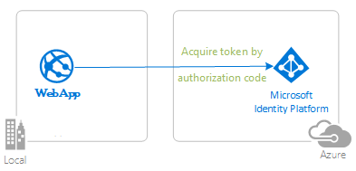
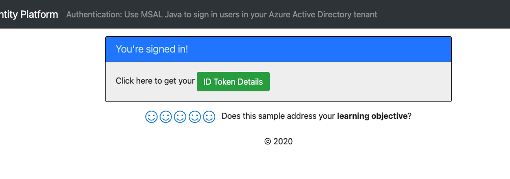

# Protect your Java Servlet web API with the Microsoft identity platform

- [Overview](#overview)
- [Scenario](#scenario)
- [Contents](#contents)
- [Prerequisites](#prerequisites)
- [Setup](#setup)
  - [Clone or download this repository](#clone-or-download-this-repository)
  - [Registration](#registration)
  - [Choose the Azure AD tenant where you want to create your applications](#choose-the-azure-ad-tenant-where-you-want-to-create-your-applications)
  - [Register the service app (java-servlet-resource-api)](#register-the-service-app-java-servlet-resource-api)
  - [Register the client app (java-servlet-webapp-client)](#register-the-client-app-java-servlet-webapp-client)
- [Running the sample](#running-the-sample)
- [Explore the sample](#explore-the-sample)
- [We'd love your feedback!](#wed-love-your-feedback)
- [About the code](#about-the-code)
- [Deployment](#deployment)
  - [Deploying web API to Azure App Services](#deploying-web-api-to-azure-app-services)
  - [Deploying web app to Azure App Services](#deploying-web-app-to-azure-app-services)
- [More information](#more-information)
- [Community Help and Support](#community-help-and-support)
- [Contributing](#contributing)


## Overview


This sample demonstrates a Java Servlet web application calling a Java Servlet web API that is secured using Azure AD. It uses the [Microsoft Authentication Library for Java](https://github.com/AzureAD/microsoft-authentication-library-for-java). It uses the OAuth2.0 protocol.

## Scenario

1. The client Java Spring web application uses the Microsoft Authentication Library (MSAL) to sign-in and obtain a JWT access token from **Azure AD**.
2. The access token is used as a *bearer* token to authorize the user to call the Java Spring web API protected by **Azure AD**.



## Contents

> Give a high-level folder structure of the sample.

| File/folder       | Description                                |
|-------------------|--------------------------------------------|
| `CHANGELOG.md`    | List of changes to the sample.             |
| `CONTRIBUTING.md` | Guidelines for contributing to the sample. |
| `LICENSE`         | The license for the sample.                |

## Prerequisites

- [JDK Version 15](https://jdk.java.net/15/). This sample has been developed on a system with Java 15 but may be compatible with other versions.
- [Maven 3](https://maven.apache.org/download.cgi)
- [Java Extension Pack for Visual Studio Code](https://marketplace.visualstudio.com/items?itemName=vscjava.vscode-java-pack) is recommended for running this sample in VSCode.
- An **Azure AD** tenant. For more information see: [How to get an Azure AD tenant](https://docs.microsoft.com/azure/active-directory/develop/quickstart-create-new-tenant)
- A user account in your **Azure AD** tenant. This sample will not work with a **personal Microsoft account**. Therefore, if you signed in to the [Azure portal](https://portal.azure.com) with a personal account and have never created a user account in your directory before, you need to do that now.

## Setup

### Clone or download this repository

From your shell or command line:

```console
    git clone https://github.com/Azure-Samples/ms-identity-java-servlet-webapp-authentication.git
    cd 3-Authorization-II/web-api
```

or download and extract the repository .zip file.

> :warning: To avoid path length limitations on Windows, we recommend cloning into a directory near the root of your drive.

### Registration

There are two projects in this sample. Each needs to be separately registered in your Azure AD tenant. To register these projects, you can:

- follow the steps below for manually register your apps
- or use PowerShell scripts that:
  - **automatically** creates the Azure AD applications and related objects (passwords, permissions, dependencies) for you.
  - modify the projects' configuration files.

<details>
  <summary>Expand this section if you want to use this automation:</summary>

> :warning: If you have never used **Azure AD Powershell** before, we recommend you go through the [App Creation Scripts](./AppCreationScripts/AppCreationScripts.md) once to ensure that your environment is prepared correctly for this step.

1. On Windows, run PowerShell as **Administrator** and navigate to the root of the cloned directory
1. If you have never used Azure AD Powershell before, we recommend you go through the [App Creation Scripts](./AppCreationScripts/AppCreationScripts.md) once to ensure that your environment is prepared correctly for this step.
1. In PowerShell run:

   ```PowerShell
   Set-ExecutionPolicy -ExecutionPolicy RemoteSigned -Scope Process -Force
   ```

1. Run the script to create your Azure AD application and configure the code of the sample application accordingly.
1. In PowerShell run:

   ```PowerShell
   cd .\AppCreationScripts\
   .\Configure.ps1
   ```

   > Other ways of running the scripts are described in [App Creation Scripts](./AppCreationScripts/AppCreationScripts.md)
   > The scripts also provide a guide to automated application registration, configuration and removal which can help in your CI/CD scenarios.

</details>

### Choose the Azure AD tenant where you want to create your applications

1. Sign in to the [Azure portal](https://portal.azure.com).
1. If your account is present in more than one Azure AD tenant, select your profile at the top right corner in the menu on top of the page, and then **switch directory** to change your portal session to the desired Azure AD tenant.

### Register the service app (java-servlet-resource-api)

1. Navigate to the [Azure portal](https://portal.azure.com) and select the **Azure AD** service.
1. Select the **App Registrations** blade on the left, then select **New registration**.
1. In the **Register an application page** that appears, enter your application's registration information:
   - In the **Name** section, enter a meaningful application name that will be displayed to users of the app, for example `java-servlet-resource-api`.
   - Under **Supported account types**, select **Accounts in this organizational directory only**.
1. Select **Register** to create the application.
1. In the app's registration screen, find and note the **Application (client) ID**. You use this value in your app's configuration file(s) later in your code.
1. Select **Save** to save your changes.
1. In the app's registration screen, select the **Expose an API** blade to the left to open the page where you can declare the parameters to expose this app as an API for which client applications can obtain [access tokens](https://docs.microsoft.com/azure/active-directory/develop/access-tokens) for.
The first thing that we need to do is to declare the unique [resource](https://docs.microsoft.com/azure/active-directory/develop/v2-oauth2-auth-code-flow) URI that the clients will be using to obtain access tokens for this API. To declare an resource URI, follow the following steps:
   - Select `Set` next to the **Application ID URI** to generate a URI that is unique for this app.
   - For this sample, accept the proposed Application ID URI (`api://{clientId}`) by selecting **Save**.
1. All APIs have to publish a minimum of one [scope](https://docs.microsoft.com/azure/active-directory/develop/v2-oauth2-auth-code-flow#request-an-authorization-code) for the client's to obtain an access token successfully. To publish a scope, follow these steps:
   - Select **Add a scope** button open the **Add a scope** screen and Enter the values as indicated below:
        - For **Scope name**, use `access_as_user`.
        - Select **Admins and users** options for **Who can consent?**.
        - For **Admin consent display name** type `Access java-servlet-resource-api`.
        - For **Admin consent description** type `Allows the app to access java-servlet-resource-api as the signed-in user.`
        - For **User consent display name** type `Access java-servlet-resource-api`.
        - For **User consent description** type `Allow the application to access java-servlet-resource-api on your behalf.`
        - Keep **State** as **Enabled**.
        - Select the **Add scope** button on the bottom to save this scope.
1. Select the `Manifest` blade on the left.
   - Set `accessTokenAcceptedVersion` property to **2**.
   - Click on **Save**.

#### Configure the service app (java-servlet-resource-api) to use your app registration

Open the project in your IDE (like Visual Studio or Visual Studio Code) to configure the code.

> In the steps below, "ClientID" is the same as "Application ID" or "AppId".

1. Open the `resource-api\src\main\resources\authentication.properties` file.
1. Find the key `Enter_Your_Tenant_ID_Here` and replace the existing value with your Azure AD tenant ID.
1. Find the key `Enter_Your_Client_ID_Here` and replace the existing value with the application ID (clientId) of `java-servlet-resource-api` app copied from the Azure portal.

### Register the client app (java-servlet-webapp-client)

1. Navigate to the [Azure portal](https://portal.azure.com) and select the **Azure AD** service.
1. Select the **App Registrations** blade on the left, then select **New registration**.
1. In the **Register an application page** that appears, enter your application's registration information:
   - In the **Name** section, enter a meaningful application name that will be displayed to users of the app, for example `java-servlet-webapp-client`.
   - Under **Supported account types**, select **Accounts in this organizational directory only**.
   - In the **Redirect URI (optional)** section, select **Web** in the combo-box and enter the following redirect URI: `http://localhost:8080/msal4j-servlet-client/auth/redirect`.
1. Select **Register** to create the application.
1. In the app's registration screen, find and note the **Application (client) ID**. You use this value in your app's configuration file(s) later in your code.
1. Select **Save** to save your changes.
1. In the app's registration screen, select the **Certificates & secrets** blade in the left to open the page where you can generate secrets and upload certificates.
1. In the **Client secrets** section, select **New client secret**:
   - Type a key description (for instance `app secret`),
   - Select one of the available key durations (**6 months**, **12 months** or **Custom**) as per your security posture.
   - The generated key value will be displayed when you select the **Add** button. Copy and save the generated value for use in later steps.
   - You'll need this key later in your code's configuration files. This key value will not be displayed again, and is not retrievable by any other means, so make sure to note it from the Azure portal before navigating to any other screen or blade.
1. In the app's registration screen, select the **API permissions** blade in the left to open the page where we add access to the APIs that your application needs.
   - Select the **Add a permission** button and then,
   - Ensure that the **My APIs** tab is selected.
   - In the list of APIs, select the API `java-servlet-resource-api`.
   - In the **Delegated permissions** section, select the **Access 'java-servlet-resource-api'** in the list. Use the search box if necessary.
   - Select the **Add permissions** button at the bottom.

#### Configure the client app (java-servlet-webapp-client) to use your app registration

Open the project in your IDE (like Visual Studio or Visual Studio Code) to configure the code.

> In the steps below, "ClientID" is the same as "Application ID" or "AppId".

1. Open the `client-web-app\src\main\resources\authentication.properties` file.
1. Find the key `Enter_Your_Tenant_ID_Here` and replace the existing value with your Azure AD tenant ID.
1. Find the key `Enter_Your_Client_ID_Here` and replace the existing value with the application ID (clientId) of `java-servlet-webapp-client` app copied from the Azure portal.
1. Find the key `Enter_Your_Client_Secret_Here` and replace the existing value with the key you saved during the creation of `java-servlet-webapp-client` copied from the Azure portal.
1. Find the key `Enter_Your_WebAPI_Client_ID_Here` and replace the existing value with the application ID (clientId) of `java-servlet-resource-api` app copied from the Azure portal.

## Running the sample

1. Make certain that your Tomcat server is running and you have privileges to deploy a web app to it.
1. Make certain that your server host address is `http://localhost:8080` (or change the `app.homePage` value in your [authentication.properties](src/main/resources/authentication.properties) file in your client app and in the AAD app registration).
1. Compile and package each project using **Maven**:

    ```Shell
    cd project-directory
    cd sub-project # client or api
    mvn clean package
    ```

1. Find the resulting `.war` file in `./client-web-api/target/msal4j-servlet-client.war` and deploy it to Tomcat or any other J2EE container solution.
     - To deploy to Tomcat, copy this `.war` file to the `/webapps/` directory in your Tomcat installation directory and start the Tomcat server.
1. Find the resulting `.war` file in `./resource-api/target/msal4j-servlet-api.war` and deploy it to Tomcat or any other J2EE container solution.
     - To deploy to Tomcat, copy this `.war` file to the `/webapps/` directory in your Tomcat installation directory and start the Tomcat server.
1. Ensure that the context path that the app is served on is `/msal4j-servlet-client` (or change the `app.homePage` value in your [authentication.properties](src/main/resources/authentication.properties) file and in the AAD app registration). If you change the properties file, you'll needs to repeat step 3 above (maven clean and package).
1. Open your browser and navigate to `http://localhost:8080/msal4j-servlet-client/`



## Explore the sample

- Note the signed-in or signed-out status displayed at the center of the screen.
- Click the context-sensitive button at the top right (it will read `Sign In` on first run)
  - Alternatively, click the link to `token details`. Since this is a protected page that requires authentication, you'll be automatically redirected to the sign-in page.
- Follow the instructions on the next page to sign in with an account in the Azure AD tenant.
- On the consent screen, note the scopes that are being requested.
- Upon successful completion of the sign-in flow, you should be redirected to the home page (`sign in status`) or `token details` page, depending on which button triggered your sign-in flow.
- Note the context-sensitive button now says `Sign out` and displays your username to its left.
- If you are on the home page, you'll see an option to click **ID Token Details**: click it to see some of the ID token's decoded claims.
- You can also use the button on the top right to sign out. The status page will reflect this.

> :information_source: Did the sample not work for you as expected? Did you encounter issues trying this sample? Then please reach out to us using the [GitHub Issues](../../../../issues) page.

## We'd love your feedback!

Were we successful in addressing your learning objective? Consider taking a moment to [share your experience with us](https://forms.office.com/Pages/ResponsePage.aspx?id=v4j5cvGGr0GRqy180BHbR73pcsbpbxNJuZCMKN0lURpURDQwVUxQWENUMlpLUlA0QzdJNVE3TUJRSyQlQCN0PWcu).

## About the code

This sample contains two projects. The client uses **MSAL for Java (MSAL4J)** to sign a user in and obtain a token for your API. The client side app is similar to the call-graph sample in chapter 2. The API app processes the incoming request and verifies that it has a valid access token. It leverages Nimbusds library to process and verify the incoming token. Please see the `resource-api/src/main/java.../helpers/JwtVerifier.java` for how the JWTverifier is set up, and `resource-api/src/main/java.../servlets/AzureAccessTokenFilter.java`

## Deployment

### Deploying web API to Azure App Services

There is one web API in this sample. To deploy it to **Azure App Services**, you'll need to:

- create an **Azure App Service**
- publish the projects to the **App Services**

### Deploying web app to Azure App Services

There is one web app in this sample. To deploy it to **Azure App Services**, you'll need to:

- create an **Azure App Service**
- publish the projects to the **App Services**, and
- update its client(s) to call the website instead of the local environment.
#### Update the Azure AD app registration (java-servlet-webapp-client)

1. Navigate back to to the [Azure portal](https://portal.azure.com).
In the left-hand navigation pane, select the **Azure Active Directory** service, and then select **App registrations (Preview)**.
1. In the resulting screen, select the `java-servlet-webapp-client` application.
1. In the app's registration screen, select **Authentication** in the menu.
   - In the **Redirect URIs** section, update the reply URLs to match the site URL of your Azure deployment. For example:
      - `https://java-servlet-webapp-client.azurewebsites.net/msal4j-servlet-client/auth/redirect`

#### Update authentication configuration parameters (java-servlet-webapp-client)

1. In your IDE, locate the `java-servlet-webapp-client` project. Then, open `client-web-app\src\main\resources\authentication.properties`.
2. Find the key for **redirect URI** and replace its value with the address of the web app you published, for example, [https://java-servlet-webapp-client.azurewebsites.net/redirect](https://java-servlet-webapp-client.azurewebsites.net/redirect).
3. Find the key for **web API endpoint** and replace its value with the address of the web API you published, for example, [https://java-servlet-resource-api.azurewebsites.net/api](https://java-servlet-resource-api.azurewebsites.net/api).

> :warning: If your app is using an *in-memory* storage, **Azure App Services** will spin down your web site if it is inactive, and any records that your app was keeping will emptied. In addition, if you increase the instance count of your website, requests will be distributed among the instances. Your app's records, therefore, will not be the same on each instance.

## More information

- [Microsoft identity platform (Azure Active Directory for developers)](https://docs.microsoft.com/azure/active-directory/develop/)
- [Overview of Microsoft Authentication Library (MSAL)](https://docs.microsoft.com/azure/active-directory/develop/msal-overview)
- [Quickstart: Register an application with the Microsoft identity platform (Preview)](https://docs.microsoft.com/azure/active-directory/develop/quickstart-register-app)
- [Quickstart: Configure a client application to access web APIs (Preview)](https://docs.microsoft.com/azure/active-directory/develop/quickstart-configure-app-access-web-apis)
- [Understanding Azure AD application consent experiences](https://docs.microsoft.com/azure/active-directory/develop/application-consent-experience)
- [Understand user and admin consent](https://docs.microsoft.com/azure/active-directory/develop/howto-convert-app-to-be-multi-tenant#understand-user-and-admin-consent)
- [Application and service principal objects in Azure Active Directory](https://docs.microsoft.com/azure/active-directory/develop/app-objects-and-service-principals)
- [National Clouds](https://docs.microsoft.com/azure/active-directory/develop/authentication-national-cloud#app-registration-endpoints)
- [MSAL code samples](https://docs.microsoft.com/azure/active-directory/develop/sample-v2-code)

For more information about how OAuth 2.0 protocols work in this scenario and other scenarios, see [Authentication Scenarios for Azure AD](https://docs.microsoft.com/azure/active-directory/develop/authentication-flows-app-scenarios).

## Community Help and Support

Use [Stack Overflow](http://stackoverflow.com/questions/tagged/msal) to get support from the community.
Ask your questions on Stack Overflow first and browse existing issues to see if someone has asked your question before.
Make sure that your questions or comments are tagged with [`azure-active-directory` `azure-ad-b2c` `ms-identity` `adal` `msal`].

If you find a bug in the sample, raise the issue on [GitHub Issues](../../../../issues).

To provide feedback on or suggest features for Azure Active Directory, visit [User Voice page](https://feedback.azure.com/forums/169401-azure-active-directory).

## Contributing

If you'd like to contribute to this sample, see [CONTRIBUTING.MD](/CONTRIBUTING.md).

This project has adopted the [Microsoft Open Source Code of Conduct](https://opensource.microsoft.com/codeofconduct/). For more information, see the [Code of Conduct FAQ](https://opensource.microsoft.com/codeofconduct/faq/) or contact [opencode@microsoft.com](mailto:opencode@microsoft.com) with any additional questions or comments.