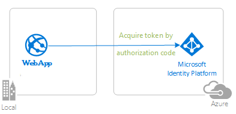

# Deploy your Python applications to Azure Cloud and use Azure App Service to manage your operations

- [Deploy your Python applications to Azure Cloud and use Azure App Service to manage your operations](#deploy-your-python-applications-to-azure-cloud-and-use-azure-app-service-to-manage-your-operations)
  - [Overview](#overview)
  - [Scenario](#scenario)
  - [Prerequisites](#prerequisites)
  - [Setup](#setup)
  - [Registration](#registration)
    - [Register the web app](#register-the-web-app)
  - [Deployment](#deployment)
    - [Step 1: Prepare the web app for deployment](#step-1-prepare-the-web-app-for-deployment)
    - [Step 2: Deploy the web app](#step-2-deploy-the-web-app)
    - [Step 3: Update your Azure AD App Registration](#step-3-update-your-azure-ad-app-registration)
  - [We'd love your feedback!](#wed-love-your-feedback)
  - [More information](#more-information)
  - [Community Help and Support](#community-help-and-support)
  - [Contributing](#contributing)
  - [Code of Conduct](#code-of-conduct)

## Overview

This sample demonstrates how to deploy a Python Flask web application to **Azure Cloud** using [Azure App Service](https://docs.microsoft.com/azure/app-service/). To do so, we will use the [code sample from flask webapp my tenant authentication](https://github.com/azure-samples/ms-identity-python-flask-webapp-authentication). You may choose to follow these steps with a different sample or your own project.

## Scenario

1. A `confidential client` web application hosted on Azure App Service uses **MSAL for Python** to sign in users to their own tenant and obtains an [ID Token](https://docs.microsoft.com/azure/active-directory/develop/id-tokens) from **Azure AD**:
2. The **ID Token** proves that a user has successfully authenticated with this tenant.
3. The web application protects one of its routes according to user's authentication status.

## Prerequisites

- An Azure Active Directory (Azure AD) tenant. For more information on how to get an Azure AD tenant, see [How to get an Azure AD tenant](https://azure.microsoft.com/documentation/articles/active-directory-howto-tenant/)
- A [user account](https://docs.microsoft.com/azure/active-directory/fundamentals/add-users-azure-active-directory) in your **Azure AD** tenant.
- [Visual Studio Code](https://code.visualstudio.com/download) is recommended for running and editing this sample.
- [VS Code Azure Tools Extension](https://marketplace.visualstudio.com/items?itemName=ms-vscode.vscode-node-azure-pack) extension is recommended for interacting with **Azure** through VS Code interface.
- An **Azure subscription**. This sample uses the free tier of **Azure App Service**.

Recommended, though not strictly necessary if not running the sample locally as well:

- [Python 3.8](https://www.python.org/downloads/)
- A virtual environment to install packages in

## Setup

Follow the setup instructions in [Flask webapp authentication (my tenant)](https://github.com/azure-samples/ms-identity-python-flask-webapp-authentication) sample or another Flask sample of your choosing from [Microsoft Identity Flask Tutorial)](https://github.com/azure-samples/ms-identity-python-flask-tutorial).

## Registration

### Register the web app

Use Azure AD app registration and matching sample that that you have completed previously.
If you have not completed a sample yet, we recommend you proceed to complete [flask webapp authentication (my tenant)](https://github.com/azure-samples/ms-identity-python-flask-webapp-authentication) sample and use the app registration from it.

## Deployment

In order to get your deployed app fully functional, you must:

1. Prepare the web app for deployment.
1. Deploy your project to **Azure App Service** and obtain a published website in the form of `https://example-domain.azurewebsites.net.`
1. Update your **Azure AD App Registration**'s redirect URIs to include the redirect URI of your deployed Flask application from the **Azure Portal**.

### Step 1: Prepare the web app for deployment

- If you are using the recommended Flask sample or one of the tutorial samples, please go to the `app.py` file and read the instructions above the `raise NotImplementedError(...)` section. Follow the instructions therein. Once you are sure you want to deploy your application, remove or comment out this line to make your app deployable.

### Step 2: Deploy the web app

This guide is for deploying to **Azure App Service** via **VS Code Azure Tools Extension**.

> You may watch the first 3 minutes of this [video tutorial](https://www.youtube.com/watch?v=dNVvFttc-sA) offered by Microsoft Dev Radio to get a video walk through of app deployment with VS Code.

- Follow the instructions in steps 1, 2, 3 and 5 in the official [Microsoft docs Python deployment tutorial](https://docs.microsoft.com/azure/developer/python/tutorial-deploy-app-service-on-linux-01).

- Work with the [flask webapp authentication (my tenant)](https://github.com/azure-samples/ms-identity-python-flask-webapp-authentication) sample or your own chosen Flask sample instead of the sample listed in the tutorial.

- Disable App Service's default authentication:

    Navigate to the **Azure App Service** Portal and locate your project. Once you do, click on the **Authentication/Authorization** blade. There, make sure that the **App Services Authentication** is switched off (and nothing else is checked), as this sample is using MSAL for authentication.

    

### Step 3: Update your Azure AD App Registration

- Navigate to the home page of your deployed app; take note of and copy the **redirect_uri** displayed on the home page.
- Navigate back to to the [Azure Portal](https://portal.azure.com).
- In the left-hand navigation pane, select the **Azure Active Directory** service, and then select **App registrations**.
- In the resulting screen, select the name of your application.
- In the Authentication blade, paste the URI you copied earlier from your deployed app instance. If the app had multiple redirect URIs, make sure to add new corresponding entries using the App service's full domain in lieu of `127.0.0.1` for each redirect URI. Save the configuration.
- From the *Branding* menu, update the **Home page URL**, to the address of your service, for example `https://example-domain.azurewebsites.net/`. Save the configuration.
- You're done! Try navigating to the hosted app!

## We'd love your feedback!

Were we successful in addressing your learning objective? Consider taking a moment to [share your experience with us](https://forms.office.com/Pages/ResponsePage.aspx?id=v4j5cvGGr0GRqy180BHbR73pcsbpbxNJuZCMKN0lURpUM0dYSFlIMzdHT0o3NlRNVFpJSzcwRVMxRyQlQCN0PWcu).

## More information

- [Azure App Services](https://docs.microsoft.com/azure/app-service/)

For more information about how OAuth 2.0 protocols work in this scenario and other scenarios, see [Authentication Scenarios for Azure AD](https://docs.microsoft.com/azure/active-directory/develop/authentication-flows-app-scenarios).

## Community Help and Support

Use [Stack Overflow](http://stackoverflow.com/questions/tagged/msal) to get support from the community.
Ask your questions on Stack Overflow first and browse existing issues to see if someone has asked your question before.
Make sure that your questions or comments are tagged with [`azure-ad` `azure-ad-b2c` `ms-identity` `msal`].

If you find a bug in the sample, please raise the issue on [GitHub Issues](../../issues).

To provide a recommendation, visit the following [User Voice page](https://feedback.azure.com/forums/169401-azure-active-directory).

## Contributing

If you'd like to contribute to this sample, see [CONTRIBUTING.MD](../../CONTRIBUTING.md).

This project has adopted the [Microsoft Open Source Code of Conduct](https://opensource.microsoft.com/codeofconduct/). For more information, see the [Code of Conduct FAQ](https://opensource.microsoft.com/codeofconduct/faq/) or contact [opencode@microsoft.com](mailto:opencode@microsoft.com) with any additional questions or comments.

## Code of Conduct

This project has adopted the [Microsoft Open Source Code of Conduct](https://opensource.microsoft.com/codeofconduct/).
For more information see the [Code of Conduct FAQ](https://opensource.microsoft.com/codeofconduct/faq/) or
contact [opencode@microsoft.com](mailto:opencode@microsoft.com) with any additional questions or comments.
