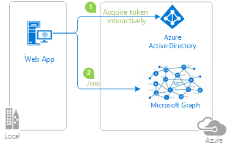

# Enable your Java Servlet web app to sign in users and restrict access to pages based on group membership with the Microsoft identity platform

- [Overview](#overview)
- [Scenario](#scenario)
- [Contents](#contents)
- [Prerequisites](#prerequisites)
- [Setup](#setup)
  - [Clone or download this repository](#clone-or-download-this-repository)
- [Register the sample application with your Azure Active Directory tenant](#register-the-sample-application-with-your-azure-active-directory-tenant)
  - [Choose the Azure AD tenant where you want to create your applications](#choose-the-azure-ad-tenant-where-you-want-to-create-your-applications)
  - [Register the web app (java-servlet-webapp-groups)](#register-the-web-app-java-servlet-webapp-groups)
  - [Configure Security Groups](#configure-security-groups)
  - [Configure the web app (java-servlet-webapp-groups) to recognize Group IDs](#configure-the-web-app-java-servlet-webapp-groups-to-recognize-group-ids)
- [Running the sample](#running-the-sample)
- [Explore the sample](#explore-the-sample)
- [We'd love your feedback!](#wed-love-your-feedback)
- [About the code](#about-the-code)
  - [Step-by-step walkthrough](#step-by-step-walkthrough)
  - [Scopes](#scopes)
- [Deploy to Azure](#deploy-to-azure)
- [More information](#more-information)
- [Community Help and Support](#community-help-and-support)
- [Contributing](#contributing)

## Overview

This sample demonstrates how to create a Java Servlet web app that signs in users with [Microsoft Authentication Library (MSAL) for Java](https://github.com/AzureAD/microsoft-authentication-library-for-java) and restricts access to pages based on Azure Active Directory group membership.



## Scenario

1. This web application uses **MSAL for Java (MSAL4J)** to sign in users an Azure AD tenant and obtains an [ID Token](https://docs.microsoft.com/azure/active-directory/develop/id-tokens) from **Azure AD**.
2. The **ID Token** proves that a user has successfully authenticated with this tenant.
3. The web application protects its routes according to user's authentication status and group membership.

## Contents

| File/folder       | Description                                |
|-------------------|--------------------------------------------|
|`AppCreationScripts/`| Scripts to automatically configure Azure AD app registrations. |
|`src/main/java/com/microsoft/azuresamples/msal4j/groups/`| This directory contains the classes that define the web app's backend business logic. |
|`____Servlet.java`    | All of the endpoints available are defined in .java classes ending in ____Servlet.java |
|`src/main/java/com/microsoft/azuresamples/msal4j/helpers/` | Helper classes for authentication. |
|`AuthenticationFilter.java`| Redirects unauthenticated requests to protected endpoints to a 401 page. |
|`src/main/resources/authentication.properties`| Azure AD and program configuration. |
|`src/main/webapp/` | This directory contains the UI (JSP templates) |
|`CHANGELOG.md`    | List of changes to the sample.             |
|`CONTRIBUTING.md` | Guidelines for contributing to the sample. |
|`LICENSE`         | The license for the sample.                |

## Prerequisites

- [JDK Version 15](https://jdk.java.net/15/). This sample has been developed on Java 15 but should be compatible with some lower versions.
- [Maven 3](https://maven.apache.org/download.cgi)
- [Tomcat 9](https://tomcat.apache.org/download-90.cgi)
- An Azure Active Directory (Azure AD) tenant. For more information on how to get an Azure AD tenant, see [How to get an Azure AD tenant](https://azure.microsoft.com/documentation/articles/active-directory-howto-tenant/)
- A user account in your own Azure AD tenant if you want to work with **accounts in your organizational directory only** (single-tenant mode). If have not yet [created a user account](https://docs.microsoft.com/azure/active-directory/fundamentals/add-users-azure-active-directory) in your AD tenant yet, you should do so before proceeding.
- A user account in any organization's Azure AD tenant if you want to work with **accounts in any organizational directory** (multi-tenant mode).  This sample must be modified to work with a **personal Microsoft account**. If have not yet [created a user account](https://docs.microsoft.com/azure/active-directory/fundamentals/add-users-azure-active-directory) in your AD tenant yet, you should do so before proceeding.
- Two security groups, **PrivilegedAdmin** and **RegularUser**, containing users you want to test with.

## Setup

### Clone or download this repository

From your shell or command line:

```console
git clone https://github.com/Azure-Samples/ms-identity-java-servlet-webapp-groups.git
```

or download and extract the repository .zip file.

> :warning: To avoid file path length limitations on Windows, clone the repository into a directory near the root of your hard drive.

## Register the sample application with your Azure Active Directory tenant

There is one project in this sample. To register the app on the portal, you can:

- either follow manual configuration steps below
- or use PowerShell scripts that:
  - **automatically** creates the Azure AD applications and related objects (passwords, permissions, dependencies) for you.
  - modify the projects' configuration files.
  - by default, the automation scripts set up an application that works with **accounts in your organizational directory only**.

<details>
  <summary>Expand this section if you want to use PowerShell automation.</summary>

1. On Windows, run PowerShell and navigate to the root of the cloned directory
1. In PowerShell run:

   ```PowerShell
   Set-ExecutionPolicy -ExecutionPolicy RemoteSigned -Scope Process -Force
   ```

1. Run the script to create your Azure AD application and configure the code of the sample application accordingly.
1. In PowerShell run:

   ```PowerShell
   cd .\AppCreationScripts\
   .\Configure.ps1
   ```

   > Other ways of running the scripts are described in [App Creation Scripts](./AppCreationScripts/AppCreationScripts.md)
   > The scripts also provide a guide to automated application registration, configuration and removal which can help in your CI/CD scenarios.

</details>

### Choose the Azure AD tenant where you want to create your applications

As a first step you'll need to:

1. Sign in to the [Azure portal](https://portal.azure.com).
1. If your account is present in more than one Azure AD tenant, select your profile at the top right corner in the menu on top of the page, and then **switch directory** to change your portal session to the desired Azure AD tenant.

### Register the web app (java-servlet-webapp-groups)

[Register a new web app](https://docs.microsoft.com/azure/active-directory/develop/quickstart-register-app) in the [Azure Portal](https://portal.azure.com).
Following this guide, you must:

1. Navigate to the Microsoft identity platform for developers [App registrations](https://go.microsoft.com/fwlink/?linkid=2083908) page.
1. Select **New registration**.
1. In the **Register an application page** that appears, enter your application's registration information:
   - In the **Name** section, enter a meaningful application name that will be displayed to users of the app, for example `java-servlet-webapp-groups`.
   - Under **Supported account types**, select an option.
     - Select **Accounts in this organizational directory only** if you're building an application for use only by users in your tenant (**single-tenant**).
     - Select **Accounts in any organizational directory** if you'd like users in any Azure AD tenant to be able to use your application (**multi-tenant**).
   - In the **Redirect URI** section, select **Web** in the combo-box and enter the following redirect URI: `http://localhost:8080/msal4j-servlet-webapp/auth/redirect`.
1. Select **Register** to create the application.
1. In the app's registration screen, find and note the **Application (client) ID**. You use this value in your app's configuration file(s) later in your code.
1. Select **Save** to save your changes.
1. In the app's registration screen, click on the **Certificates & secrets** blade in the left to open the page where we can generate secrets and upload certificates.
1. In the **Client secrets** section, click on **New client secret**:
   - Type a key description (for instance `app secret`),
   - Select one of the available key durations (**In 1 year**, **In 2 years**, or **Never Expires**) as per your security concerns.
   - The generated key value will be displayed when you click the **Add** button. Copy the generated value for use in the steps later.
   - You'll need this key later in your code's configuration files. This key value will not be displayed again, and is not retrievable by any other means, so make sure to note it from the Azure portal before navigating to any other screen or blade.
1. In the app's registration screen, select the **API permissions** blade in the left to open the page where we add access to the APIs that your application needs.
   - Select the **Add a permission** button and then:
   - Ensure that the **Microsoft APIs** tab is selected.
       - In the *Commonly used Microsoft APIs* section, select **Microsoft Graph**
       - In the **Delegated permissions** section, select **User.Read** and **GroupMember.Read.All** in the list. Use the search box if necessary.
       - Select the **Add permissions** button at the bottom.
   - **GroupMember.Read.All** requires admin consent. Select the **Grant/revoke admin consent for {tenant}** button, and then select **Yes** when you are asked if you want to grant consent for the requested permissions for all accounts in the tenant. You need to be an Azure AD tenant admin to do this.

#### Configure the web app (java-servlet-webapp-groups) to use your app registration

Open the project in your IDE to configure the code.

> In the steps below, "ClientID" is the same as "Application ID" or "AppId".

1. Open the `./src/main/resources/authentication.properties` file
2. Find the string `{enter-your-tenant-id-here}`. Replace the existing value with:
    - **Your Azure AD tenant ID** if you registered your app with the **Accounts in this organizational directory only** option.
    - The word `organizations` if you registered your app with the **Accounts in any organizational directory** option.
3. Find the string `{enter-your-client-id-here}` and replace the existing value with the application ID (clientId) of the `java-servlet-webapp-groups` application copied from the Azure portal.
4. Find the string `{enter-your-client-secret-here}` and replace the existing value with the key you saved during the creation of the `java-servlet-webapp-groups` app, in the Azure portal.

### Configure Security Groups

You have two different options available to you on how you can further configure your application(s) to receive the `groups` claim.

1. [Receive **all the groups** that the signed-in user is assigned to in an Azure AD tenant, included nested groups](#configure-your-application-to-receive-all-the-groups-the-signed-in-user-is-assigned-to-including-nested-groups).
2. [Receive the **groups** claim values from a **filtered set of groups** that your application is programmed to work with](#configure-your-application-to-receive-the-groups-claim-values-from-a-filtered-set-of-groups-a-user-may-be-assigned-to) (Not available in the [Azure AD Free edition](https://azure.microsoft.com/pricing/details/active-directory/)).

> To get the on-premise group's `samAccountName` or `On Premises Group Security Identifier` instead of Group ID, please refer to the document [Configure group claims for applications with Azure Active Directory](https://docs.microsoft.com/azure/active-directory/hybrid/how-to-connect-fed-group-claims#prerequisites-for-using-group-attributes-synchronized-from-active-directory).

#### Configure your application to receive **all the groups** the signed-in user is assigned to, including nested groups

1. In the app's registration screen, select the **Token Configuration** blade in the left to open the page where you can configure the claims provided tokens issued to your application.
1. Select the **Add groups claim** button on top to open the **Edit Groups Claim** screen.
1. Select `Security groups` **or** the `All groups (includes distribution lists but not groups assigned to the application)` option. Choosing both negates the effect of `Security Groups` option.
1. Under the **ID** section, select `Group ID`. This will result in Azure AD sending the [Object ID](https://docs.microsoft.com/graph/api/resources/group?view=graph-rest-1.0) of the groups the user is assigned to in the **groups** claim of the [ID Token](https://docs.microsoft.com/azure/active-directory/develop/id-tokens) that your app receives after signing-in a user.

#### Configure your application to receive the `groups` claim values from a **filtered set of groups** a user may be assigned to

##### Prerequisites, benefits and limitations of using this option

1. This option is useful when your application is interested in a selected set of groups that a signing-in user may be assigned to and not every security group this user is assigned to in the tenant. This option also saves your application from running into the [overage](#the-groups-overage-claim) issue.
1. This feature is not available in the [Azure AD Free edition](https://azure.microsoft.com/pricing/details/active-directory/).
1. **Nested group assignments** are not available when this option is utilized.

##### Steps to enable this option in your app

1. In the app's registration screen, select the **Token Configuration** blade in the left to open the page where you can configure the claims provided tokens issued to your application.
1. Select the **Add groups claim** button on top to open the **Edit Groups Claim** screen.
1. Select `Groups assigned to the application`.
    1. Choosing additional options like `Security Groups` or `All groups (includes distribution lists but not groups assigned to the application)` will negate the benefits your app derives from choosing to use this option.
1. Under the **ID** section, select `Group ID`. This will result in Azure AD sending the [Object ID](https://docs.microsoft.com/graph/api/resources/group?view=graph-rest-1.0) of the groups the user is assigned to in the `groups` claim of the [ID Token](https://docs.microsoft.com/azure/active-directory/develop/id-tokens).
1. If you are exposing a web API using the **Expose an API** option, then you can also choose the `Group ID` option under the **Access** section. This will result in Azure AD sending the [Object ID](https://docs.microsoft.com/graph/api/resources/group?view=graph-rest-1.0) of the groups the user is assigned to in the `groups` claim of the [Access Token](https://docs.microsoft.com/azure/active-directory/develop/access-tokens).
1. In the app's registration screen, select on the **Overview** blade in the left to open the Application overview screen. Select the hyperlink with the name of your application in **Managed application in local directory** (note this field title can be truncated for instance `Managed application in ...`). When you select this link you will navigate to the **Enterprise Application Overview** page associated with the service principal for your application in the tenant where you created it. You can navigate back to the app registration page by using the *back* button of your browser.
1. Select the **Users and groups** blade in the left to open the page where you can assign users and groups to your application.
    1. Select the **Add user** button on the top row.
    1. Select **User and Groups** from the resultant screen.
    1. Choose the groups that you want to assign to this application.
    1. Click **Select** in the bottom to finish selecting the groups.
    1. Select **Assign** to finish the group assignment process.  
    1. Your application will now receive these selected groups in the `groups` claim when a user signing in to your app is a member of  one or more these **assigned** groups.
1. Select the **Properties** blade in the left to open the page that lists the basic properties of your application.Set the **User assignment required?** flag to **Yes**.

> :bulb: **Important security tip**
>
> When you set **User assignment required?** to **Yes**, Azure AD will check that only users assigned to your application in the **Users and groups** blade are able to sign-in to your app. You can assign users directly or by assigning security groups they belong to.

### Configure the web app (java-servlet-webapp-groups) to recognize Group IDs

> :warning:
> During **Token Configuration**, if you have chosen any other option except **groupID** (e.g. like **DNSDomain\sAMAccountName**) you should enter the **group name** (for example `contoso.com\Test Group`) instead of the **object ID** below:

1. Open the `./src/main/resources/authentication.properties` file.
2. Find the string `{enter-your-admins-group-id-here}` and replace the existing value with the **object ID** of the **PrivilegedAdmin** group copied from the Azure portal.
3. Find the string `{enter-your-users-group-id-here}` and replace the existing value with the **object ID** of the **RegularUser** group copied from the Azure portal.

## Running the sample

1. Make certain that your Tomcat server is running and you have privileges to deploy a web app to it.
2. Make certain that your server host address is `http://localhost:8080` (or change the `app.homePage` value in your [authentication.properties](src/main/resources/authentication.properties) file and in the AAD app registration).
3. Compile and package the project using **Maven**:

    ```Shell
    cd project-directory
    mvn clean package
    ```

4. Find the resulting `.war` file in `./target/msal4j-servlet-webapp.war` and deploy it to Tomcat or any other J2EE container solution.
     - To deploy to Tomcat, copy this `.war` file to the `/webapps/` directory in your Tomcat installation directory and start the Tomcat server.
5. Ensure that the context path that the app is served on is `/msal4j-servlet-webapp` (or change the `app.homePage` value in your [authentication.properties](src/main/resources/authentication.properties) file and in the AAD app registration). If you change the properties file, you'll needs to repeat step 3 above (maven clean and package).
6. Open your browser and navigate to `http://localhost:8080/msal4j-servlet-webapp/`


## Explore the sample

- Note the signed-in or signed-out status displayed at the center of the screen.
- Click the context-sensitive button at the top right (it will read `Sign In` on first run)
- Follow the instructions on the next page to sign in with an account in the Azure AD tenant.
- On the consent screen, note the scopes that are being requested.
- Note the context-sensitive button now says `Sign out` and displays your username to its left.
- The middle of the screen now has an option to click for **ID Token Details**: click it to see some of the ID token's decoded claims.
- Click the **Admin Only** or **Regular User**button to access the groups claim protected endpoints.
  - If your signed in user is in the PrivilegedAdmin group, the user will be able to enter both pages.
  - If your signed in user is in the RegularUser group, the user will be able to enter the Regular User page only.
  - If your signed in user is in neither group, the user will be able to access to none of the two pages.
- You can also use the button on the top right to sign out.
- After signing out, click the link to `ID Token Details` to observe that the app displays a `401: unauthorized` error instead of the ID token claims when the user is not authorized.

> :information_source: Did the sample not work for you as expected? Did you encounter issues trying this sample? Then please reach out to us using the [GitHub Issues](../../issues) page.

## We'd love your feedback!

Were we successful in addressing your learning objective? Consider taking a moment to [share your experience with us](https://forms.office.com/Pages/ResponsePage.aspx?id=v4j5cvGGr0GRqy180BHbR73pcsbpbxNJuZCMKN0lURpURDQwVUxQWENUMlpLUlA0QzdJNVE3TUJRSyQlQCN0PWcu).

## About the code

This sample uses **MSAL for Java (MSAL4J)** to sign a user in and obtain a token for MS Graph API. It leverages [Microsoft Graph SDK for Java](https://github.com/microsoftgraph/msgraph-sdk-java) to obtain data from Graph. You must add these to your projects using Maven. As a developer, you may copy the `AuthHelper.java`,`Config.java`, `MsalAuthSession.java` and `GraphHelper.java` classes to your project to access the functionality demonstrated by this sample.

A **ConfidentialClientApplication** instance is created in the [AuthHelper.java](src/main/java/com/microsoft/azuresamples/authentication/AuthHelper.java) class. This object helps craft the AAD authorization URL and also helps exchange the authentication token for an access token.

```Java
// getConfidentialClientInstance method
IClientSecret secret = ClientCredentialFactory.createFromSecret(SECRET);
confClientInstance = ConfidentialClientApplication
                    .builder(CLIENT_ID, secret)
                    .authority(AUTHORITY)
                    .build();
```

The following parameters need to be provided upon instantiation:

- The **Client ID** of the app
- The **Client Secret**, which is a requirement for Confidential Client Applications
- The **Azure AD Authority**, which includes your AAD tenant ID.

In this sample, these values are read from the [authentication.properties](src/main/resources/authentication.properties) file using a properties reader in the class [Config.java](src/main/java/com/microsoft/azuresamples/authentication/Config.java).

### Step-by-step walkthrough

1. The first step of the sign-in process is to send a request to the `/authorize` endpoint on for our Azure Active Directory Tenant. Our MSAL4J `ConfidentialClientApplication` instance is leveraged to construct an authorization request URL. Our app redirects the browser to this URL, which is where the user will sign in.

    ```Java
    final ConfidentialClientApplication client = getConfidentialClientInstance();
    final AuthorizationRequestUrlParameters parameters = AuthorizationRequestUrlParameters
        .builder(REDIRECT_URI, Collections.singleton(SCOPES)).responseMode(ResponseMode.QUERY)
        .prompt(Prompt.SELECT_ACCOUNT).state(state).nonce(nonce).build();

    final String redirectUrl = client.getAuthorizationRequestUrl(parameters).toString();
    Config.logger.log(Level.INFO, "Redirecting user to {0}", redirectUrl);
    resp.setStatus(302);
    resp.sendRedirect(redirectUrl);
    ```

    - **AuthorizationRequestUrlParameters**: Parameters that must be set in order to build an AuthorizationRequestUrl.
    - **REDIRECT_URI**: Where AAD will redirect the browser (along with auth code) after collecting user credentials. It must match the redirect URI in the  Azure AD app registration on [Azure Portal](https://portal.azure.com)
    - **SCOPES**: [Scopes](https://docs.microsoft.com/azure/active-directory/develop/access-tokens#scopes) are permissions requested by the application.
      - Normally, the three scopes `openid profile offline_access` suffice for receiving an ID Token response.
      - Full list of scopes requested by the app can be found in the [authentication.properties file](./src/main/resources/authentication.properties). You can add more scopes like User.Read and so on.
    - **ResponseMode.QUERY**: AAD can return the response as form params in an HTTP POST request or as query string params in an HTTP GET request. You'd normally leave this as-is.
    - **Prompt.SELECT_ACCOUNT**: AAD should ask the user to select the account that they intend to authenticate against. The [OIDC protocol documentation](https://openid.net/specs/openid-connect-core-1_0.html#AuthRequest) lists other available options and their uses.
    - **state**: a unique variable set by the app into the session on each token request, and destroyed after receiving the corresponding AAD redirect callback. The state variable ensures that AAD requests to the [/auth/redirect endpoint](src/main/java/com/microsoft/azuresamples/authentication/AADRedirectServlet.java) are actually from AAD authorization requests originating from this app and this session, thereby preventing CSRF attacks.You'd normally leave this as-is.
    - **nonce**: a unique variable set by the app into the session on each token request, and destroyed after receiving the corresponding token. This nonce is transcribed to the resulting tokens dispensed AAD, thereby ensuring that there is no token-replay attack occurring. You'd normally leave this as-is.

2. The user is presented with a sign-in prompt by Azure Active Directory. If the sign-in attempt is successful, the user's browser is redirected to our app's redirect endpoint. A valid request to this endpoint will contain an [**authorization code**](https://docs.microsoft.com/azure/active-directory/develop/v2-oauth2-auth-code-flow).
3. Our ConfidentialClientApplication instance then exchanges this authorization code for an ID Token and Access Token from Azure Active Directory.

    ```Java
    final AuthorizationCodeParameters authParams = AuthorizationCodeParameters
                        .builder(authCode, new URI(REDIRECT_URI))
                        .scopes(Collections.singleton(SCOPES)).build();

    final ConfidentialClientApplication client = AuthHelper
            .getConfidentialClientInstance();
    final Future<IAuthenticationResult> future = client.acquireToken(authParams);
    final IAuthenticationResult result = future.get();
    ```

    - **AuthorizationCodeParameters**: Parameters that must be set in order to exchange the Authorization Code for an ID and/or access token.
    - **authCode**: The authorization code that was received at the redirect endpoint.
    - **REDIRECT_URI**: The redirect URI used in the previous step must be passed again.
    - **SCOPES**: The scopes used in the previous step must be passed again.

4. If `acquireToken` is successful, the token claims are extracted and the nonce claim is validated against the nonce stored in the session.

    ```Java
    parseJWTClaimsSetAndStoreResultInSession(msalAuth, result, serializedTokenCache);
    validateNonce(msalAuth)
    processSuccessfulAuthentication(msalAuth);
    ```

5. If the nonce is successfully validated, authentication status is put into a server-side session, leveraging methods exposed by the class [MsalAuthSession.java](src/main/java/com/microsoft/azuresamples/authentication/MsalAuthSession.java):

    ```Java
    msalAuth.setAuthenticated(true);
    msalAuth.setUsername(msalAuth.getIdTokenClaims().get("name"));
   ```

### Scopes

- [Scopes](https://docs.microsoft.com/azure/active-directory/develop/v2-permissions-and-consent) tell Azure AD the level of access that the application is requesting.
- Based on the requested scopes, Azure AD presents a consent dialogue to the user upon signing in.
- If the user consents to one or more scopes and obtains a token, the scopes-consented-to are encoded into the resulting `access_token`.
- Note the scope requested by the application by referring to [authentication.properties](./src/main/resources/authentication.properties). By default, the application sets the scopes value to `User.Read`.
- This particular MS Graph API scope is for accessing the information of the currently-signed-in user. The graph endpoint for accessing this info is `https://graph.microsoft.com/v1.0/me`
- Any valid requests made to this endpoint must bear an `access_token` that contains the scope `User.Read` in the Authorization header.

## Deploy to Azure

Follow [this guide](https://github.com/Azure-Samples/ms-identity-java-servlet-webapp-deployment) to deploy this app to **Azure App Service**.

## More information

- [Microsoft Authentication Library \(MSAL\) for Java](https://github.com/AzureAD/microsoft-authentication-library-for-java)
- [Microsoft identity platform (Azure Active Directory for developers)](https://docs.microsoft.com/azure/active-directory/develop/)
- [Quickstart: Register an application with the Microsoft identity platform (Preview)](https://docs.microsoft.com/azure/active-directory/develop/quickstart-register-app)

- [Understanding Azure AD application consent experiences](https://docs.microsoft.com/azure/active-directory/develop/application-consent-experience)
- [Understand user and admin consent](https://docs.microsoft.com/azure/active-directory/develop/howto-convert-app-to-be-multi-tenant#understand-user-and-admin-consent)
- [MSAL code samples](https://docs.microsoft.com/azure/active-directory/develop/sample-v2-code)

## Community Help and Support

Use [Stack Overflow](https://stackoverflow.com/questions/tagged/msal) to get support from the community.
Ask your questions on Stack Overflow first and browse existing issues to see if someone has asked your question before.
Make sure that your questions or comments are tagged with [`azure-active-directory` `ms-identity` `adal` `msal`].

If you find a bug in the sample, please raise the issue on [GitHub Issues](../../issues).

To provide a recommendation, visit the following [User Voice page](https://feedback.azure.com/forums/169401-azure-active-directory).

## Contributing

This project welcomes contributions and suggestions. Most contributions require you to agree to a Contributor License Agreement (CLA) declaring that you have the right to, and actually do, grant us the rights to use your contribution. For details, visit https://cla.opensource.microsoft.com