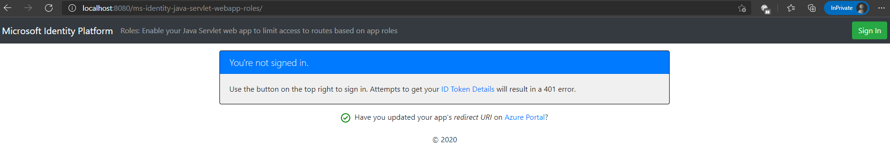

# Enable your Java Servlet web app to sign in users and call Microsoft Graph with the Microsoft identity platform

- [Overview](#overview)
- [Scenario](#scenario)
- [Contents](#contents)
- [Prerequisites](#prerequisites)
- [Setup](#setup)
  - [Clone or download this repository](#clone-or-download-this-repository)
- [Register the sample application with your Azure Active Directory tenant](#register-the-sample-application-with-your-azure-active-directory-tenant)
  - [Choose the Azure AD tenant where you want to create your applications](#choose-the-azure-ad-tenant-where-you-want-to-create-your-applications)
  - [Register the web app (java-servlet-webapp-call-graph)](#register-the-web-app-java-servlet-webapp-call-graph)
  - [Configure the web app (java-servlet-webapp-call-graph) to use your app registration](#configure-the-web-app-java-servlet-webapp-call-graph-to-use-your-app-registration)
- [Running the sample](#running-the-sample)
- [Explore the sample](#explore-the-sample)
- [We'd love your feedback!](#wed-love-your-feedback)
- [About the code](#about-the-code)
  - [Step-by-step walkthrough](#step-by-step-walkthrough)
  - [Scopes](#scopes)
- [Deploy to Azure](#deploy-to-azure)
- [More information](#more-information)
- [Community Help and Support](#community-help-and-support)
- [Contributing](#contributing)

## Overview

This sample shows how a Java servlet web app that uses [OpenID Connect](https://docs.microsoft.com/azure/active-directory/develop/v1-protocols-openid-connect-code) to sign in users and use Azure AD Application Roles (app roles) for authorization. App roles, along with Security groups are popular means to implement authorization.

This application implements RBAC using Azure AD's Application Roles & Role Claims feature. Another approach is to use Azure AD Groups and Group Claims. Azure AD Groups and Application Roles are by no means mutually exclusive; they can be used in tandem to provide even finer grained access control.

Using RBAC with Application Roles and Role Claims, developers can securely enforce authorization policies with minimal effort on their part.

- A Microsoft Identity Platform Office Hours session covered Azure AD App roles and security groups, featuring this scenario and this sample. A recording of the session is is provided in this video [Using Security Groups and Application Roles in your apps](https://www.youtube.com/watch?v=LRoc-na27l0)

For more information about how the protocols work in this scenario and other scenarios, see [Authentication Scenarios for Azure AD](http://go.microsoft.com/fwlink/?LinkId=394414).

## Scenario

1. This web application uses **MSAL for Java (MSAL4J)** to sign in a user and obtain an [ID Token](https://docs.microsoft.com/azure/active-directory/develop/id-tokens) from **Azure AD**:


This sample first leverages the  **MSAL for Java (MSAL4J)** to sign in the user. On the home page it displays an option for the user to view the claims in their ID Tokens. This web application also allows the users to view a privileged admin page or a regular user page depending on the app role they have been assigned to. The idea is to provide an example of how, within an application, access to certain functionality/page is restricted to subsets of users depending on which role they belong to.

This kind of authorization is implemented using role-based access control (RBAC). When using RBAC, an administrator grants permissions to roles, not to individual users or groups. The administrator can then assign roles to different users and groups to control who has then access to certain content and functionality.  

This sample application defines the following two *Application Roles*:

- `PrivilegedAdmin`: Authorized to access the PrivilegedAdmin page.
- `RegularUser`: Authorized to access the RegularUser page 

These application roles are defined in the [Azure portal](https://portal.azure.com) in the application's registration manifest.  When a user signs into the application, Azure AD emits a `roles` claim for each role that the user has been granted individually to the user in the from of role membership.  Assignment of users and groups to roles can be done through the portal's UI, or programmatically using the [Microsoft Graph](https://graph.microsoft.com) and [Azure AD PowerShell](https://docs.microsoft.com/powershell/module/azuread/?view=azureadps-2.0).  In this sample, application role management is done through the Azure portal or using PowerShell.

NOTE: Role claims will not be present for guest users in a tenant if the `https://login.microsoftonline.com/common/` endpoint is used as the authority to sign in users.


## Contents

| File/folder       | Description                                |
|-------------------|--------------------------------------------|
|`AppCreationScripts/`| Scripts to automatically configure Azure AD app registrations. |
|`src/main/java/com/microsoft/azuresamples/roles/`| This directory contains the classes that define the web app's backend business logic. |
|`AuthHelper.java` | Helper functions for authentication. |
|`AuthException.java` | Exception class to group auth-related errors and handle them differently. |
|`Config.java` | Runs on startup and configures properties reader and logger. |
|`AuthenticationFilter.java`| Redirects unauthenticated requests to protected endpoints to a 401 page. |
|`MsalAuthSession` | Instantiated with an HttpSession, stores all MSAL related session attributes in session attribute. |
|`____Servlet.java`    | All of the endpoints available are defined in .java classes ending in ____Servlet.java |
|`src/main/resources/authentication.properties`| Azure AD and program configuration. |
|`src/main/webapp/` | This directory contains the UI (JSP templates) |
|`CHANGELOG.md`    | List of changes to the sample.             |
|`CONTRIBUTING.md` | Guidelines for contributing to the sample. |
|`LICENSE`         | The license for the sample.                |

## Prerequisites

- [JDK Version 15](https://jdk.java.net/15/). This sample has been developed on Java 15 but should be compatible with some lower versions.
- [Maven 3](https://maven.apache.org/download.cgi)
- [Tomcat 9](https://tomcat.apache.org/download-90.cgi)
- An Azure Active Directory (Azure AD) tenant. For more information on how to get an Azure AD tenant, see [How to get an Azure AD tenant](https://azure.microsoft.com/documentation/articles/active-directory-howto-tenant/)
- A user account in your own Azure AD tenant if you want to work with **accounts in your organizational directory only** (single-tenant mode). If have not yet [created a user account](https://docs.microsoft.com/azure/active-directory/fundamentals/add-users-azure-active-directory) in your AD tenant yet, you should do so before proceeding.
- A user account in any organization's Azure AD tenant if you want to work with **accounts in any organizational directory** (multi-tenant mode).  This sample must be modified to work with a **personal Microsoft account**. If have not yet [created a user account](https://docs.microsoft.com/azure/active-directory/fundamentals/add-users-azure-active-directory) in your AD tenant yet, you should do so before proceeding.
- A personal Microsoft account (e.g., Xbox, Hotmail, Live, etc) if you want to work with **personal Microsoft accounts**

## Setup

### Clone or download this repository

From your shell or command line:

```console
git clone https://github.com/Azure-Samples/ms-identity-java-servlet-webapp-roles.git
```

or download and extract the repository .zip file.

> :warning: To avoid file path length limitations on Windows, clone the repository into a directory near the root of your hard drive.

## Register the sample application with your Azure Active Directory tenant

There is one project in this sample. To register the app on the portal, you can:

- either follow manual configuration steps below
- or use PowerShell scripts that:
  - **automatically** creates the Azure AD applications and related objects (passwords, permissions, dependencies) for you.
  - modify the projects' configuration files.
  - by default, the automation scripts set up an application that works with **accounts in your organizational directory only**.

<details>
  <summary>Expand this section if you want to use PowerShell automation.</summary>

1. On Windows, run PowerShell and navigate to the root of the cloned directory
1. In PowerShell run:

   ```PowerShell
   Set-ExecutionPolicy -ExecutionPolicy RemoteSigned -Scope Process -Force
   ```

1. Run the script to create your Azure AD application and configure the code of the sample application accordingly.
1. In PowerShell run:

   ```PowerShell
   cd .\AppCreationScripts\
   .\Configure.ps1
   ```

   > Other ways of running the scripts are described in [App Creation Scripts](./AppCreationScripts/AppCreationScripts.md)
   > The scripts also provide a guide to automated application registration, configuration and removal which can help in your CI/CD scenarios.

</details>

### Choose the Azure AD tenant where you want to create your applications

As a first step you'll need to:

1. Sign in to the [Azure portal](https://portal.azure.com).
1. If your account is present in more than one Azure AD tenant, select your profile at the top right corner in the menu on top of the page, and then **switch directory** to change your portal session to the desired Azure AD tenant.

### Register the web app (java-servlet-webapp-roles)

[Register a new web app](https://docs.microsoft.com/azure/active-directory/develop/quickstart-register-app) in the [Azure Portal](https://portal.azure.com).
Following this guide, you must:

1. Navigate to the Microsoft identity platform for developers [App registrations](https://go.microsoft.com/fwlink/?linkid=2083908) page.
1. Select **New registration**.
1. In the **Register an application page** that appears, enter your application's registration information:
   - In the **Name** section, enter a meaningful application name that will be displayed to users of the app, for example `java-servlet-webapp-roles`.
   - Under **Supported account types**, select an option.
     - Select **Accounts in this organizational directory only** if you're building an application for use only by users in your tenant (**single-tenant**).
     - Select **Accounts in any organizational directory** if you'd like users in any Azure AD tenant to be able to use your application (**multi-tenant**).
     - Select **Accounts in any organizational directory and personal Microsoft accounts** for the widest set of customers (**multi-tenant** that also supports Microsoft personal accounts).
   - Select **Personal Microsoft accounts** for use only by users of personal Microsoft accounts (e.g., Hotmail, Live, Skype, Xbox accounts).
   - In the **Redirect URI** section, select **Web** in the combo-box and enter the following redirect URI: `http://localhost:8080/ms-identity-java-servlet-webapp-roles/auth/redirect`.
1. Select **Register** to create the application.
1. In the app's registration screen, find and note the **Application (client) ID**. You use this value in your app's configuration file(s) later in your code.
1. Select **Save** to save your changes.
1. In the app's registration screen, click on the **Certificates & secrets** blade in the left to open the page where we can generate secrets and upload certificates.
1. In the **Client secrets** section, click on **New client secret**:
   - Type a key description (for instance `app secret`),
   - Select one of the available key durations (**In 1 year**, **In 2 years**, or **Never Expires**) as per your security concerns.
   - The generated key value will be displayed when you click the **Add** button. Copy the generated value for use in the steps later.
   - You'll need this key later in your code's configuration files. This key value will not be displayed again, and is not retrievable by any other means, so make sure to note it from the Azure portal before navigating to any other screen or blade.

##### Define your Application Roles

1. In the blade for your  application in Azure Portal, click **Manifest**.
1. Edit the manifest by locating the `appRoles` setting and adding the two Application Roles.  The role definitions are provided in the JSON code block below.  Leave the `allowedMemberTypes` to **User** only.  Each role definition in this manifest must have a different valid **Guid** for the "id" property. Note that the `"value"` property of each role is set to the exact strings **DirectoryViewers** and **UserReaders** (as these strings are used in the code in the application).
1. Save the manifest.

The content of `appRoles` should be the following (the `id` should be a unique Guid)

```JSon
{
  ...
    "appRoles": [
        {
            "allowedMemberTypes": [
                "User"
            ],
            "description": "Authorized to access the PrivilegedAdmin page.",
            "displayName": "PrivilegedAdmin",
            "id": "a816142a-2e8e-46c4-9997-f984faccb625",
            "isEnabled": true,
            "lang": null,
            "origin": "Application",
            "value": "UserReaders"
        },
        {
            "allowedMemberTypes": [
                "User"
            ],
            "description": "Authorized to access the RegularUser page.",
            "displayName": "RegularUser",
            "id": "72ff9f52-8011-49e0-a4f4-cc1bb26206fa",
            "isEnabled": true,
            "lang": null,
            "origin": "Application",
            "value": "DirectoryViewers"
        }
    ],
 ...
}
```

> Note:  To receive the `roles` claim with the name of the app roles this user is assigned to, make sure that the user accounts you plan to sign-in to this app is assigned to the app roles of this app. The guide, [Assign a user or group to an enterprise app in Azure Active Directory](https://docs.microsoft.com/azure/active-directory/manage-apps/assign-user-or-group-access-portal#assign-a-user-to-an-app---portal) provides step by step instructions.


### Configure the web app (java-servlet-webapp-roles) to use your app registration

Open the project in your IDE to configure the code.

> In the steps below, "ClientID" is the same as "Application ID" or "AppId".

1. Open the `./src/main/resources/authentication.properties` file
2. Find the string `{enter-your-tenant-id-here}`. Replace the existing value with:
    - **Your Azure AD tenant ID** if you registered your app with the **Accounts in this organizational directory only** option.
    - The word `organizations` if you registered your app with the **Accounts in any organizational directory** option.
    - The word `common` if you registered your app with the **Accounts in any organizational directory and personal Microsoft accounts** option.
    - The word `consumers` if you registered your app with the **Personal Microsoft accounts** option
3. Find the string `{enter-your-client-id-here}` and replace the existing value with the application ID (clientId) of the `java-servlet-webapp-call-graph` application copied from the Azure portal.
4. Find the string `{enter-your-client-secret-here}` and replace the existing value with the key you saved during the creation of the `java-servlet-webapp-roles` app, in the Azure portal.

## Running the sample

1. Make certain that your Tomcat server is running and you have privileges to deploy a web app to it.
2. Make certain that your server host address is `http://localhost:8080` (or change the `app.homePage` value in your [authentication.properties](src/main/resources/authentication.properties) file and in the AAD app registration).
3. Compile and package the project using **Maven**:

    ```Shell
    cd project-directory
    mvn clean package
    ```

4. Find the resulting `.war` file in `./target/ms-identity-java-servlet-webapp-roles.war` and deploy it to Tomcat or any other J2EE container solution.
     - To deploy to Tomcat, copy this `.war` file to the `/webapps/` directory in your Tomcat installation directory and start the Tomcat server.
5. Ensure that the context path that the app is served on is `/ms-identity-java-servlet-webapp-roles` (or change the `app.homePage` value in your [authentication.properties](src/main/resources/authentication.properties) file and in the AAD app registration). If you change the properties file, you'll needs to repeat step 3 above (maven clean and package).
6. Open your browser and navigate to `http://localhost:8080/ms-identity-java-servlet-webapp-roles/`



## Explore the sample

- Note the signed-in or signed-out status displayed at the center of the screen.
- Click the context-sensitive button at the top right (it will read `Sign In` on first run)
- Follow the instructions on the next page to sign in with an account in the Azure AD tenant.
- On the consent screen, note the scopes that are being requested.
- Note the context-sensitive button now says `Sign out` and displays your username to its left.
- The middle of the screen now has an option to click for **ID Token Details**: click it to see some of the ID token's decoded claims.
- Click the **Admin Page** button to view the Admin page. Only users with app role **PrivilegedAdmin** will be able to view this page. Otherwise an authorization failure message will be displayed. 
- Click the **User Page** button to view the Admin page. Only users with app role **RegularUser** will be able to view this page. Otherwise an authorization failure message will be displayed. 
- You can also use the button on the top right to sign out.
- After signing out, click the link to `ID Token Details` to observe that the app displays a `401: unauthorized` error instead of the ID token claims when the user is not authorized.

> :information_source: Did the sample not work for you as expected? Did you encounter issues trying this sample? Then please reach out to us using the [GitHub Issues](../../issues) page.

## We'd love your feedback!

Were we successful in addressing your learning objective? Consider taking a moment to [share your experience with us](https://forms.office.com/Pages/ResponsePage.aspx?id=v4j5cvGGr0GRqy180BHbR73pcsbpbxNJuZCMKN0lURpURDQwVUxQWENUMlpLUlA0QzdJNVE3TUJRSyQlQCN0PWcu).

## About the code

This sample uses **MSAL for Java (MSAL4J)** to sign a user in and obtain an ID token that may contain the roles claim. Based on the roles claim present, the signed in user will be able to access two protected pages, Admin Page and User Page. As a developer, you may copy the `AuthHelper.java`,`Config.java`, `MsalAuthSession.java` classes to your project to access the functionality demonstrated by this sample.

A **ConfidentialClientApplication** instance is created in the [AuthHelper.java](src/main/java/com/microsoft/azuresamples/authentication/AuthHelper.java) class. This object helps craft the AAD authorization URL and also helps exchange the authentication token for an access token.

```Java
// getConfidentialClientInstance method
IClientSecret secret = ClientCredentialFactory.createFromSecret(SECRET);
confClientInstance = ConfidentialClientApplication
                    .builder(CLIENT_ID, secret)
                    .authority(AUTHORITY)
                    .build();
```

The following parameters need to be provided upon instantiation:

- The **Client ID** of the app
- The **Client Secret**, which is a requirement for Confidential Client Applications
- The **Azure AD Authority**, which includes your AAD tenant ID.

In this sample, these values are read from the [authentication.properties](src/main/resources/authentication.properties) file using a properties reader in the class [Config.java](src/main/java/com/microsoft/azuresamples/authentication/Config.java).

### Step-by-step walkthrough

1. The first step of the sign-in process is to send a request to the `/authorize` endpoint on for our Azure Active Directory Tenant. Our MSAL4J `ConfidentialClientApplication` instance is leveraged to construct an authorization request URL. Our app redirects the browser to this URL, which is where the user will sign in.

    ```Java
    final ConfidentialClientApplication client = getConfidentialClientInstance();
    final AuthorizationRequestUrlParameters parameters = AuthorizationRequestUrlParameters
        .builder(REDIRECT_URI, Collections.singleton(SCOPES)).responseMode(ResponseMode.QUERY)
        .prompt(Prompt.SELECT_ACCOUNT).state(state).nonce(nonce).build();

    final String redirectUrl = client.getAuthorizationRequestUrl(parameters).toString();
    Config.logger.log(Level.INFO, "Redirecting user to {0}", redirectUrl);
    resp.setStatus(302);
    resp.sendRedirect(redirectUrl);
    ```

    - **AuthorizationRequestUrlParameters**: Parameters that must be set in order to build an AuthorizationRequestUrl.
    - **REDIRECT_URI**: Where AAD will redirect the browser (along with auth code) after collecting user credentials. It must match the redirect URI in the  Azure AD app registration on [Azure Portal](https://portal.azure.com)
    - **SCOPES**: [Scopes](https://docs.microsoft.com/azure/active-directory/develop/access-tokens#scopes) are permissions requested by the application.
      - Normally, the three scopes `openid profile offline_access` suffice for receiving an ID Token response.
      - Full list of scopes requested by the app can be found in the [authentication.properties file](./src/main/resources/authentication.properties). You can add more scopes like User.Read and so on.
    - **ResponseMode.QUERY**: AAD can return the response as form params in an HTTP POST request or as query string params in an HTTP GET request. You'd normally leave this as-is.
    - **Prompt.SELECT_ACCOUNT**: AAD should ask the user to select the account that they intend to authenticate against. The [OIDC protocol documentation](https://openid.net/specs/openid-connect-core-1_0.html#AuthRequest) lists other available options and their uses.
    - **state**: a unique variable set by the app into the session on each token request, and destroyed after receiving the corresponding AAD redirect callback. The state variable ensures that AAD requests to the [/auth/redirect endpoint](src/main/java/com/microsoft/azuresamples/authentication/AADRedirectServlet.java) are actually from AAD authorization requests originating from this app and this session, thereby preventing CSRF attacks.You'd normally leave this as-is.
    - **nonce**: a unique variable set by the app into the session on each token request, and destroyed after receiving the corresponding token. This nonce is transcribed to the resulting tokens dispensed AAD, thereby ensuring that there is no token-replay attack occurring. You'd normally leave this as-is.

2. The user is presented with a sign-in prompt by Azure Active Directory. If the sign-in attempt is successful, the user's browser is redirected to our app's redirect endpoint. A valid request to this endpoint will contain an [**authorization code**](https://docs.microsoft.com/azure/active-directory/develop/v2-oauth2-auth-code-flow).
3. Our ConfidentialClientApplication instance then exchanges this authorization code for an ID Token and Access Token from Azure Active Directory.

    ```Java
    final AuthorizationCodeParameters authParams = AuthorizationCodeParameters
                        .builder(authCode, new URI(REDIRECT_URI))
                        .scopes(Collections.singleton(SCOPES)).build();

    final ConfidentialClientApplication client = AuthHelper
            .getConfidentialClientInstance();
    final Future<IAuthenticationResult> future = client.acquireToken(authParams);
    final IAuthenticationResult result = future.get();
    ```

    - **AuthorizationCodeParameters**: Parameters that must be set in order to exchange the Authorization Code for an ID and/or access token.
    - **authCode**: The authorization code that was received at the redirect endpoint.
    - **REDIRECT_URI**: The redirect URI used in the previous step must be passed again.
    - **SCOPES**: The scopes used in the previous step must be passed again.

4. If `acquireToken` is successful, the token claims are extracted and the nonce claim is validated against the nonce stored in the session.

    ```Java
    parseJWTClaimsSetAndStoreResultInSession(msalAuth, result, serializedTokenCache);
    validateNonce(msalAuth)
    processSuccessfulAuthentication(msalAuth);
    ```

5. If the nonce is successfully validated, authentication status is put into a server-side session, leveraging methods exposed by the class [MsalAuthSession.java](src/main/java/com/microsoft/azuresamples/authentication/MsalAuthSession.java):

    ```Java
    msalAuth.setAuthenticated(true);
    msalAuth.setUsername(msalAuth.getIdTokenClaims().get("name"));
   ```
6. Once the user clicks on the Admin Page, the program control flows to the AuthorizationFilter class which has the logic to verify if the user has the **PrivilegedAdmin** role associated with them. Auth error page is displayed if the logged in user doesn't have the role. 
   
  ```Java
		if (request.getRequestURI().contains("privileged_admin")) {

			Map<String, String> idTokenClaims = msalAuth.getIdTokenClaims();
			String roles = idTokenClaims.get(ROLES);
			if (roles == null || !roles.contains(PRIVILEGED_ADMIN)) {
				Config.logger.log(Level.INFO, "redirecting to error page to display auth error to user.");
				req.setAttribute("bodyContent", "auth/403.jsp");
				req.setAttribute("details", UNAUTHORIZED_PRIVILEGED_ADMIN_MESSAGE);
				final RequestDispatcher view = request.getRequestDispatcher("index.jsp");
				view.forward(request, response);
			}
		}
   ```
7. Once the user clicks on the User Page, the program control flows to the AuthorizationFilter class which has the logic to verify if the user has the **RegularUser** role associated with them. Auth error page is displayed if the logged in user doesn't have the role. 
  
  ```Java
  	if (request.getRequestURI().contains("regular_user")) {
			Map<String, String> idTokenClaims = msalAuth.getIdTokenClaims();
			String roles = idTokenClaims.get(ROLES);
			if (roles == null || !roles.contains(REGULAR_USER)) {
				Config.logger.log(Level.INFO, "redirecting to error page to display auth error to user.");
				req.setAttribute("bodyContent", "auth/403.jsp");
				req.setAttribute("details", UNAUTHORIZED_REGULAR_USER_MESSAGE);
				final RequestDispatcher view = request.getRequestDispatcher("index.jsp");
				view.forward(request, response);
				return;
			}
		}
  ```


## Scopes

- [Scopes](https://docs.microsoft.com/azure/active-directory/develop/v2-permissions-and-consent) tell Azure AD the level of access that the application is requesting.
- Based on the requested scopes, Azure AD presents a consent dialogue to the user upon signing in.


## Deploy to Azure

Follow [this guide](https://github.com/Azure-Samples/ms-identity-java-servlet-webapp-deployment) to deploy this app to **Azure App Service**.

## More information

- [Microsoft Authentication Library \(MSAL\) for Java](https://github.com/AzureAD/microsoft-authentication-library-for-java)
- [Microsoft identity platform (Azure Active Directory for developers)](https://docs.microsoft.com/azure/active-directory/develop/)
- [Quickstart: Register an application with the Microsoft identity platform (Preview)](https://docs.microsoft.com/azure/active-directory/develop/quickstart-register-app)

- [Understanding Azure AD application consent experiences](https://docs.microsoft.com/azure/active-directory/develop/application-consent-experience)
- [Understand user and admin consent](https://docs.microsoft.com/azure/active-directory/develop/howto-convert-app-to-be-multi-tenant#understand-user-and-admin-consent)
- [MSAL code samples](https://docs.microsoft.com/azure/active-directory/develop/sample-v2-code)

## Community Help and Support

Use [Stack Overflow](https://stackoverflow.com/questions/tagged/msal) to get support from the community.
Ask your questions on Stack Overflow first and browse existing issues to see if someone has asked your question before.
Make sure that your questions or comments are tagged with [`azure-active-directory` `ms-identity` `adal` `msal`].

If you find a bug in the sample, please raise the issue on [GitHub Issues](../../issues).

To provide a recommendation, visit the following [User Voice page](https://feedback.azure.com/forums/169401-azure-active-directory).

## Contributing

This project welcomes contributions and suggestions. Most contributions require you to agree to a Contributor License Agreement (CLA) declaring that you have the right to, and actually do, grant us the rights to use your contribution. For details, visit https://cla.opensource.microsoft.com