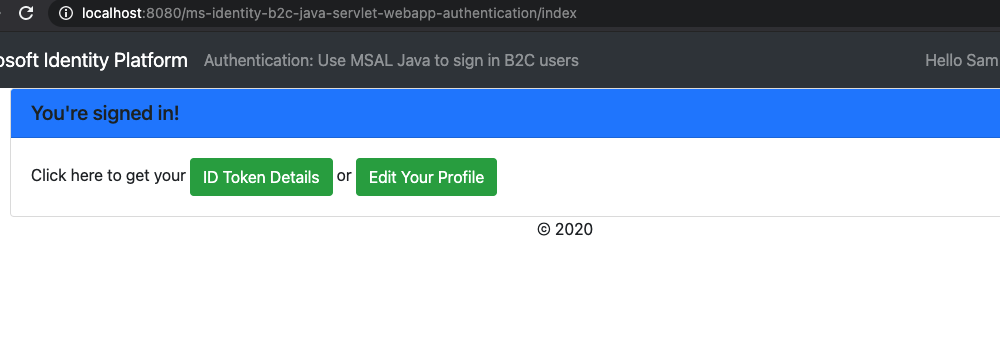

# Enable your Java Servlet web app to sign in users to your Azure Active Directory tenant with the Microsoft identity platform

- [Overview](#overview)
- [Scenario](#scenario)
- [Contents](#contents)
- [Prerequisites](#prerequisites)
- [Setup](#setup)
  - [Step 1: Clone or download this repository](#step-1-clone-or-download-this-repository)
  - [Step 2: Install project dependencies](#step-2-install-project-dependencies)
- [Register the sample application(s) with your Azure Active Directory tenant](#register-the-sample-applications-with-your-azure-active-directory-tenant)
  - [Choose the Azure AD tenant where you want to create your applications](#choose-the-azure-ad-tenant-where-you-want-to-create-your-applications)
  - [Register the web app (java-servlet-webapp-auth-my-tenant)](#register-the-web-app-java-servlet-webapp-auth-my-tenant)
  - [Configure the web app (java-servlet-webapp-auth-my-tenant) to use your app registration](#configure-the-web-app-java-servlet-webapp-auth-my-tenant-to-use-your-app-registration)
- [Running the sample](#running-the-sample)
- [Explore the sample](#explore-the-sample)
- [We'd love your feedback!](#wed-love-your-feedback)
- [About the code](#about-the-code)
  - [Step-by-step walkthrough](#step-by-step-walkthrough)
- [Next Steps or Deploy to Azure](#next-steps-or-deploy-to-azure)
- [Community Help and Support](#community-help-and-support)
- [Contributing](#contributing)
- [Code of Conduct](#code-of-conduct)
- [More information](#more-information)

## Overview

This sample demonstrates a Java Servlet web app that signs in users to your Azure Active Directory tenant using the [Microsoft Authentication Library (MSAL) for Java](https://github.com/AzureAD/microsoft-authentication-library-for-java).


## Scenario

1. This web application uses the **MSAL for Java (MSAL4J)** to sign in users to their own Azure AD tenant and obtains an [ID Token](https://docs.microsoft.com/azure/active-directory/develop/id-tokens) from **Azure AD**.
1. The **ID Token** proves that a user has successfully authenticated with this tenant.
1. The web application protects one of its routes according to user's authentication status.

## Contents

| File/folder       | Description                                |
|-------------------|--------------------------------------------|
|`AppCreationScripts/`| Scripts to automatically configure Azure AD app registrations. |
|`src/main/java/com/microsoft/azuresamples/callgraph/`| This directory contains the classes that define the web app's backend business logic. |
|`AuthHelper.java` | Helper functions for authentication. |
|`Config.java` | Runs on startup and configures properties reader and logger. |
|`AuthenticationFilter.java`| Redirects unauthenticated requests to protected endpoints to a 401 page. |
|`MsalAuthSession` | Instantiated with an HttpSession, stores all MSAL related session attributes in session attribute. |
|`____Servlet.java`    | All of the endpoints available are defined in .java classes ending in ____Servlet.java |
|`src/main/resources/authentication.properties`| Azure AD and program configuration. |
|`src/main/webapp/` | This directory contains the UI (JSP templates |)
|`CHANGELOG.md`    | List of changes to the sample.             |
|`CONTRIBUTING.md` | Guidelines for contributing to the sample. |
|`LICENSE`         | The license for the sample.                |

## Prerequisites

- [JDK Version 8 or higher](https://jdk.java.net/14/)
- [Maven 3](https://maven.apache.org/download.cgi)
- [Tomcat 9](https://tomcat.apache.org/download-90.cgi)
- An Azure Active Directory (Azure AD) tenant. For more information on how to get an Azure AD tenant, see [How to get an Azure AD tenant](https://azure.microsoft.com/documentation/articles/active-directory-howto-tenant/)
- A user account in your own Azure AD tenant. This sample will not work with a **personal Microsoft account**. If have not yet [created a user account](https://docs.microsoft.com/azure/active-directory/fundamentals/add-users-azure-active-directory) in your AD tenant yet, you should do so before proceeding.

## Setup

### Step 1: Clone or download this repository

From your shell or command line:

```console
git clone https://github.com/Azure-Samples/ms-identity-java-servlet-webapp-authentication.git
```

or download and extract the repository .zip file.

> :warning: To avoid file path length limitations on Windows, clone the repository into a directory near the root of your hard drive.

### Step 2: Install project dependencies

```Console
cd project-directory
mvn install -f pom.xml
```

## Register the sample application(s) with your Azure Active Directory tenant

There is one project in this sample. To register the app on the portal, you can:

- either follow manual configuration steps below
- or use PowerShell scripts that:
  - **automatically** creates the Azure AD applications and related objects (passwords, permissions, dependencies) for you.
  - modify the projects' configuration files.

<details>
  <summary>Expand this section if you want to use PowerShell automation.</summary>

1. On Windows, run PowerShell and navigate to the root of the cloned directory
1. In PowerShell run:

   ```PowerShell
   Set-ExecutionPolicy -ExecutionPolicy RemoteSigned -Scope Process -Force
   ```

1. Run the script to create your Azure AD application and configure the code of the sample application accordingly.
1. In PowerShell run:

   ```PowerShell
   cd .\AppCreationScripts\
   .\Configure.ps1
   ```

   > Other ways of running the scripts are described in [App Creation Scripts](./AppCreationScripts/AppCreationScripts.md)
   > The scripts also provide a guide to automated application registration, configuration and removal which can help in your CI/CD scenarios.

</details>

### Choose the Azure AD tenant where you want to create your applications

As a first step you'll need to:

1. Sign in to the [Azure portal](https://portal.azure.com).
1. If your account is present in more than one Azure AD tenant, select your profile at the top right corner in the menu on top of the page, and then **switch directory** to change your portal session to the desired Azure AD tenant.

### Register the web app (java-servlet-webapp-auth-my-tenant)

1. Navigate to the Microsoft identity platform for developers [App registrations](https://go.microsoft.com/fwlink/?linkid=2083908) page.
1. Select **New registration**.
1. In the **Register an application page** that appears, enter your application's registration information:
   - In the **Name** section, enter a meaningful application name that will be displayed to users of the app, for example `java-servlet-webapp-auth-my-tenant`.
   - Under **Supported account types**, select **Accounts in this organizational directory only**.
   - In the **Redirect URI** section, select **Web** in the combo-box and enter the following redirect URI: `http://localhost:8080/ms-identity-java-servlet-webapp-authentication/auth_redirect`.
1. Select **Register** to create the application.
1. In the app's registration screen, find and note the **Application (client) ID**. You use this value in your app's configuration file(s) later in your code.

1. Select **Save** to save your changes.

1. In the app's registration screen, click on the **Certificates & secrets** blade in the left to open the page where we can generate secrets and upload certificates.
1. In the **Client secrets** section, click on **New client secret**:
   - Type a key description (for instance `app secret`),
   - Select one of the available key durations (**In 1 year**, **In 2 years**, or **Never Expires**) as per your security concerns.
   - The generated key value will be displayed when you click the **Add** button. Copy the generated value for use in the steps later.
   - You'll need this key later in your code's configuration files. This key value will not be displayed again, and is not retrievable by any other means, so make sure to note it from the Azure portal before navigating to any other screen or blade.

### Configure the web app (java-servlet-webapp-auth-my-tenant) to use your app registration

Open the project in your IDE to configure the code.

> In the steps below, "ClientID" is the same as "Application ID" or "AppId".

1. Open the `./src/main/resources/authentication.properties` file
2. Find the string `{enter-your-tenant-id-here}` and replace the existing value with your Azure AD tenant ID.
3. Find the string `{enter-your-client-id-here}` and replace the existing value with the application ID (clientId) of the `java-servlet-webapp-auth-my-tenant` application copied from the Azure portal.
4. Find the string `{enter-your-client-secret-here}` and replace the existing value with the key you saved during the creation of the `java-servlet-webapp-auth-my-tenant` app, in the Azure portal.

</details>

## Running the sample

1. Make certain that your Tomcat server is running and you have privileges to deploy a web app to it.
1. Make certain that it serves the web app on `http://localhost:8080` (or change the base addresses listed in the [authentication.properties](src/main/resources/authentication.properties) file and in the AAD app registration).
1. Compile and package the project using **Maven**:

    ```Shell
    cd project-directory
    mvn package -f pom.xml
    ```

1. Find the resulting `.war` file in `./target/ms-identity-java-servlet-webapp-authentication.war` and upload it to your server.
1. Ensure that the context path that the app is served on is `http://localhost:8080/ms-identity-java-servlet-webapp-authentication` (or change the addresses listed in the [authentication.properties](src/main/resources/authentication.properties) file and in the AAD app registration).
1. Open your browser and navigate to `http://localhost:8080/ms-identity-java-servlet-webapp-authentication/index`



## Explore the sample

- Note the signed-in or signed-out status displayed at the center of the screen.
- Click the context-sensitive button at the top right (it will read `Sign In` on first run)
- Follow the instructions on the next page to sign in with an account in the Azure AD tenant.
- On the consent screen, note the scopes that are being requested.
- Note the context-sensitive button now says `Sign out` and displays your username to its left.
- The middle of the screen now has an option to click for **ID Token Details**: click it to see some of the ID token's decoded claims.
- You can also use the button on the top right to sign out.
- After signing out, click the link to `ID Token Details` to observe that the app displays a `401: unauthorized` error instead of the ID token claims when the user is not authorized.

> :information_source: Did the sample not work for you as expected? Did you encounter issues trying this sample? Then please reach out to us using the [GitHub Issues](../../issues) page.

## We'd love your feedback!

Were we successful in addressing your learning objective? Consider taking a moment to [share your experience with us](https://forms.office.com/Pages/ResponsePage.aspx?id=v4j5cvGGr0GRqy180BHbR73pcsbpbxNJuZCMKN0lURpUM0dYSFlIMzdHT0o3NlRNVFpJSzcwRVMxRyQlQCN0PWcu).

## About the code

This sample shows how to use **MSAL for Java (MSAL4J)** to sign in users into your Azure AD tenant. You must add it to the project using Maven. As a developer, you may copy `AuthHelper.java`,`Config.java` and `MsalAuthSession.java` classes to your project to access the functionality demonstrated by this sample.

A **ConfidentialClientApplication** instance is created in the [AuthHelper.java](src/main/java/com/microsoft/azuresamples/authentication/AuthHelper.java) class. This object helps craft the AAD authorization URL and also helps exchange the authentication token for an access token.

```Java
// getConfidentialClientInstance method
IClientSecret secret = ClientCredentialFactory.createFromSecret(SECRET);
confClientInstance = ConfidentialClientApplication
                    .builder(CLIENT_ID, secret)
                    .authority(AUTHORITY)
                    .build();
```

The following parameters need to be provided upon instantiation:

- The **Client ID** of the app
- The **Client Secret**, which is a requirement for Confidential Client Applications
- The **Azure AD Authority**, which includes your AAD tenant ID.

In this sample, these values are read from the [authentication.properties](src/main/resources/authentication.properties) file using a properties reader in the class [Config.java](src/main/java/com/microsoft/azuresamples/authentication/Config.java).

### Step-by-step walkthrough

1. The first step of the sign-in process is to send a request to the `/authorize` endpoint on for our Azure Active Directory Tenant. Our MSAL4J `ConfidentialClientApplication` instance is leveraged to construct an authorization request URL. Our app redirects the browser to this URL, which is where the user will sign in.

    ```Java
    final ConfidentialClientApplication client = getConfidentialClientInstance();
    final AuthorizationRequestUrlParameters parameters = AuthorizationRequestUrlParameters
        .builder(REDIRECT_URI, Collections.singleton(SCOPES)).responseMode(ResponseMode.QUERY)
        .prompt(Prompt.SELECT_ACCOUNT).state(state).nonce(nonce).build();

    final String redirectUrl = client.getAuthorizationRequestUrl(parameters).toString();
    Config.logger.log(Level.INFO, "Redirecting user to {0}", redirectUrl);
    resp.setStatus(302);
    resp.sendRedirect(redirectUrl);
    ```

    - **AuthorizationRequestUrlParameters**: Parameters that must be set in order to build an AuthorizationRequestUrl.
    - **REDIRECT_URI**: Where AAD will redirect the browser (along with auth code) after collecting user credentials. It must match the redirect URI in the  Azure AD app registration on https://portal.azure.com
    - **SCOPES**: [Scopes](https://docs.microsoft.com/azure/active-directory/develop/access-tokens#scopes) are permissions requested by the application.
      - Normally, the three scopes `openid profile offline_access` suffice for receiving an ID Token response.
      - Full list of scopes requested by the app can be found in the [authentication.properties file](./src/main/resources/authentication.properties). You can add more scopes like User.Read and so on.
    - **ResponseMode.QUERY**: AAD can return the response as form params in an HTTP POST request or as query string params in an HTTP GET request. You'd normally leave this as-is.
    - **Prompt.SELECT_ACCOUNT**: AAD should ask the user to select the account that they intend to authenticate against. The [OIDC protocol documentation](https://openid.net/specs/openid-connect-core-1_0.html#AuthRequest) lists other available options and their uses.
    - **state**: a unique variable set by the app into the session on each token request, and destroyed after receiving the corresponding AAD redirect callback. The state variable ensures that AAD requests to the [/auth_redirect endpoint](src/main/java/com/microsoft/azuresamples/authentication/AADRedirectServlet.java) are actually from AAD authorization requests originating from this app and this session, thereby preventing CSRF attacks.You'd normally leave this as-is.
    - **nonce**: a unique variable set by the app into the session on each token request, and destroyed after receiving the corresponding token. This nonce is transcribed to the resulting tokens dispensed AAD, thereby ensuring that there is no token-replay attack occurring. You'd normally leave this as-is.

2. The user is presented with a sign-in prompt by Azure Active Directory. If the sign-in attempt is successful, the user's browser is redirected to our app's redirect endpoint. A valid request to this endpoint will contain an [**authorization code**](https://docs.microsoft.com/azure/active-directory/develop/v2-oauth2-auth-code-flow).
3. Our ConfidentialClientApplication instance then exchanges this authorization code for an ID Token and Access Token from Azure Active Directory.

    ```Java
    final AuthorizationCodeParameters authParams = AuthorizationCodeParameters
                        .builder(authCode, new URI(REDIRECT_URI))
                        .scopes(Collections.singleton(SCOPES)).build();

    final ConfidentialClientApplication client = AuthHelper
            .getConfidentialClientInstance();
    final Future<IAuthenticationResult> future = client.acquireToken(authParams);
    final IAuthenticationResult result = future.get();
    ```

    - **AuthorizationCodeParameters**: Parameters that must be set in order to exchange the Authorization Code for an ID and/or access token.
    - **authCode**: The authorization code that was received at the redirect endpoint.
    - **REDIRECT_URI**: The redirect URI used in the previous step must be passed again.
    - **SCOPES**: The scopes used in the previous step must be passed again.

4. If `acquireToken` is successful, the token claims are extracted and the nonce claim is validated against the nonce stored in the session.

    ```Java
    parseJWTClaimsSetAndStoreResultInSession(msalAuth, result, serializedTokenCache);
    validateNonce(msalAuth)
    processSuccessfulAuthentication(msalAuth);
    ```

5. If the nonce is successfully validated, authentication status is put into a server-side session, leveraging methods exposed by the class [MsalAuthSession.java](src/main/java/com/microsoft/azuresamples/authentication/MsalAuthSession.java):

    ```Java
    msalAuth.setAuthenticated(true);
    msalAuth.setUsername(msalAuth.getIdTokenClaims().get("name"));
    ```

## Next Steps or Deploy to Azure

As next steps, we can now either [get an Access Token for the users we signed-in in this tutorial](https://github.com/Azure-Samples/ms-identity-java-servlet-webapp-call-graph), or we can proceed [to deploy this app to the **Azure App Service**](https://github.com/Azure-Samples/ms-identity-java-servlet-deployment).

## Community Help and Support

Use [Stack Overflow](https://stackoverflow.com/questions/tagged/msal) to get support from the community.
Ask your questions on Stack Overflow first and browse existing issues to see if someone has asked your question before.
Make sure that your questions or comments are tagged with [`azure-active-directory` `ms-identity` `java` `msal`].

If you find a bug in the sample, please raise the issue on [GitHub Issues](../../issues).

To provide a recommendation, visit the following [User Voice page](https://feedback.azure.com/forums/169401-azure-active-directory).

## Contributing

This project welcomes contributions and suggestions. Most contributions require you to agree to a Contributor License Agreement (CLA) declaring that you have the right to, and actually do, grant us the rights to use your contribution. For details, visit https://cla.opensource.microsoft.com

## Code of Conduct

This project has adopted the Microsoft Open Source Code of Conduct. For more information see the Code of Conduct FAQ or contact opencode@microsoft.com with any additional questions or comments.

## More information

- [Microsoft Authentication Library \(MSAL\) for Java](https://github.com/AzureAD/microsoft-authentication-library-for-java)
- [MSAL Java Reference Documentation](http://javadoc.io/doc/com.microsoft.azure/msal4j)
- [Microsoft identity platform (Azure Active Directory for developers)](https://docs.microsoft.com/azure/active-directory/develop/)
- [Quickstart: Register an application with the Microsoft identity platform (Preview)](https://docs.microsoft.com/azure/active-directory/develop/quickstart-register-app)
- [Understanding Azure AD application consent experiences](https://docs.microsoft.com/azure/active-directory/develop/application-consent-experience)
- [Understand user and admin consent](https://docs.microsoft.com/azure/active-directory/develop/howto-convert-app-to-be-multi-tenant#understand-user-and-admin-consent)
- [MSAL code samples](https://docs.microsoft.com/azure/active-directory/develop/sample-v2-code)
